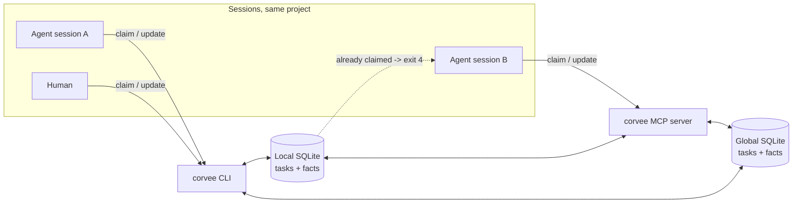

# Corvee

> A single-machine, non-git-tracked, persistent, multi-agent-aware CLI task
> tracker and fact store. Track any work that outlives one session, whether
> a person or an AI agent picks it back up.

Are you sick of losing track of work across sessions, or of agents that
hallucinate and forget between them? Then Corvee might be a helpful tool
for you and your agents!

<div align="center">

[](https://github.com/btschwertfeger/corvee)
[](LICENSE)
[](pyproject.toml)

[](https://pepy.tech/project/corvee)
[](https://pypi.org/project/corvee/)

[](https://github.com/astral-sh/ruff)
[](https://github.com/astral-sh/ty)
[](https://github.com/btschwertfeger/Corvee/actions/workflows/cicd.yaml)
[](https://app.codecov.io/gh/btschwertfeger/Corvee)

[](https://www.bestpractices.dev/projects/14702)
[](https://securityscorecards.dev/viewer/?uri=github.com/btschwertfeger/Corvee)

[](https://corvee.readthedocs.io/en/latest/)
[](https://doi.org/10.5281/zenodo.22877769)

</div>

Work loses context between sessions, and concurrent workers collide
mid-task. corvee tracks tasks, todos, decisions, and checked-true facts in
a local SQLite database instead of chat history or a markdown file, so a
person or an agent picks up exactly where the last session left off, and
several of them share one project without silently overwriting each
other's edits.

See the [documentation site](https://corvee.readthedocs.io/en/latest/) for
the full pitch, the [Quickstart](docs/quickstart.md), the
[Commands](docs/commands.md) reference, the
[Specification](docs/spec.md), and the [MCP server](docs/mcp.md) for
hosts that speak Model Context Protocol natively instead of shelling out
to the CLI.



Every task and fact lives in exactly one of these two independent databases,
picked with `--global` at creation time and encoded in the id from then on.
`--scope all` (the default for listing) reads both.

## Use cases

corvee is not tied to code. A project is any workspace you return to, and a
task is any unit of work worth resuming.

- Software work. One repository's backlog, with each agent session
  claiming the task it works on.
- Research. A reading queue, open questions, and checked findings stored
  with the source that established each one.
- Writing and editing. Chapters, revisions, and reviews, plus editorial
  decisions you do not want to look up twice.
- Operations and home labs. Recurring chores and machine-wide facts such
  as certificate expirations, filed with `--global`.
- Personal tracking. Anything with a state and a history, run straight
  from the terminal with no agent involved.

See [Use cases](docs/use-cases.md) for worked examples.

corvee itself is built with spec-driven development: [`docs/spec.md`](docs/spec.md)
is written and extended before any code, then implemented and refined
across many iterations.

## Install

```bash
uv tool install corvee
```

Hosts that speak MCP natively instead of shelling out to the CLI need the
`mcp` extra and `corvee mcp serve` (see [MCP server](docs/mcp.md) for
per-host setup):

```bash
uv tool install 'corvee[mcp]'
```

## Quickstart

```bash
cd your-project
corvee init                              # once per project

corvee task add "Fix the flaky auth test" --description "..."
corvee task list --json
corvee task claim TASK-1
corvee task update TASK-1 --state done   # claim clears automatically

corvee fact add "requests is Apache-2.0 licensed" --proof "pip show requests"
corvee fact search "license" --json
```

`corvee explain` prints a compact, agent-oriented cheat sheet from inside
any initialized project. See [Quickstart](docs/quickstart.md) for facts,
global scope, and the full core loop.

## License

[Apache-2.0](LICENSE)

## Contributing

See [CONTRIBUTING.md](CONTRIBUTING.md) for the development setup and the
project's quality gate.
