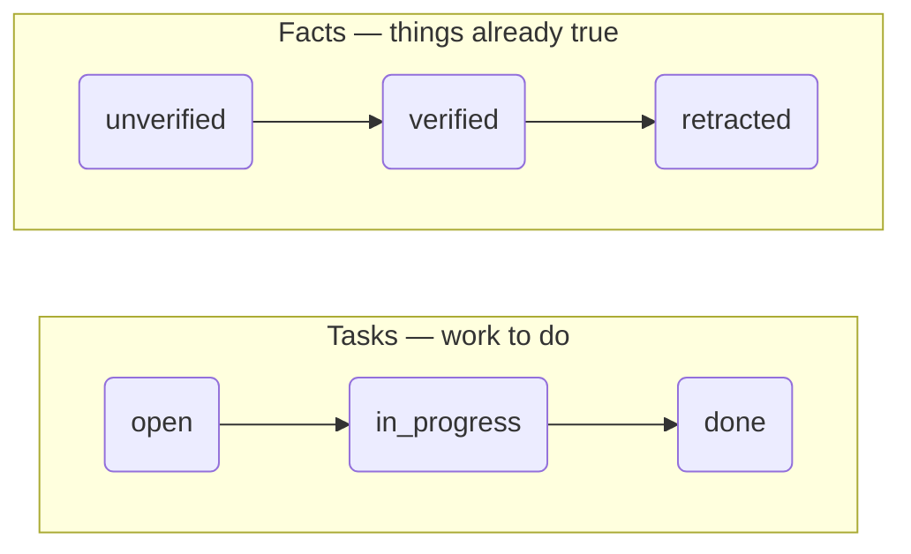

# corvee

A single-machine, non-git-tracked, persistent CLI task tracker and fact
store. It tracks tasks, todos, decisions, and progress within a single
project or workspace, across sessions, for people and AI agents alike, and
lets several of them work the same project concurrently without colliding.

Instead of re-deriving "what was I doing" from chat history, or silently
overwriting a collaborator's edit, you query and claim work through
`corvee`.

## Why

Context goes missing between sessions, and two workers still collide
mid-task. corvee solves both problems with one mechanism: a shared SQLite
database on disk, and a claim/unclaim protocol that makes "someone is
actively working on this right now" an explicit, queryable fact instead of
an assumption. It replaces the ad hoc TODO.md or scratch notes file you
would otherwise keep, with one queryable, claimable backlog.

## Comments and events persist reasoning

Every claim, state change, and `task comment` writes a row to that task's
event history as part of the same write, not a separate step an agent can
forget. `corvee task comment TASK-14 "blocked on the staging credentials
rotation"` leaves a freeform note; `corvee task show TASK-14` replays the
full history under `events:`, so the next session, agent or human, reads
*why* a decision was made instead of re-deriving it from scratch.

## Facts guard against hallucination

Tasks and facts are two independent stores with different shapes, not one
generic "item" type:

Facts like a license, a decided API shape, or a verified environment detail
get buried in prose, commit messages, or code comments, where they are hard
to prove and get re-derived by everyone who stumbles onto them again.
`corvee fact list` and `corvee fact search` surface claims other agents
already verified, each carrying the proof that established it and a
timestamp. Trusting a `verified` fact costs one lookup. Marking a fact
`verified` requires `--proof` describing what actually established the
claim, such as a command's output or a specific test run. `fact revise`
drops a verified fact back to `unverified` the moment its wording changes,
so `verified` always describes the text currently under it.

## Who it is for

Anything that needs durable state across sessions fits, including code.
A researcher tracks a reading queue and keeps each verified finding with
the source behind it. Chapters and editorial decisions are a writer's
backlog. Certificate rotations and other machine-wide facts live in the
global database. People run corvee directly, with no agent in the loop,
and the claim protocol protects a person and an agent sharing one backlog
the same way it protects two agents. [Use cases](use-cases.md) has worked
examples.

## What it is not

- Not a replacement for GitHub/GitLab Issues. Issues are hosted and shared
  across machines. corvee's database is local, per-machine state, scoped to
  the finer-grained work packages inside one session, such as a task an
  agent spins off to a subagent. No hosted sync, no cross-machine access.
- Not for machines without a shared filesystem. Concurrency is scoped to one
  machine: multiple agents and/or humans in separate terminals, processes,
  or git worktrees.
- No web UI, no notifications, no scheduling.

See [Quickstart](quickstart.md) to get going, [Commands](commands.md) for
the full command reference, and [Concurrency model](concurrency.md) for how
multiple agents safely share one backlog. For a host that speaks Model
Context Protocol natively instead of shelling out to the CLI, see the
[MCP server](mcp.md). [Specification](spec.md) is the technical
specification and the single source of truth for exact behavior. The rest
of this site is a narrative companion to it, not a replacement.
