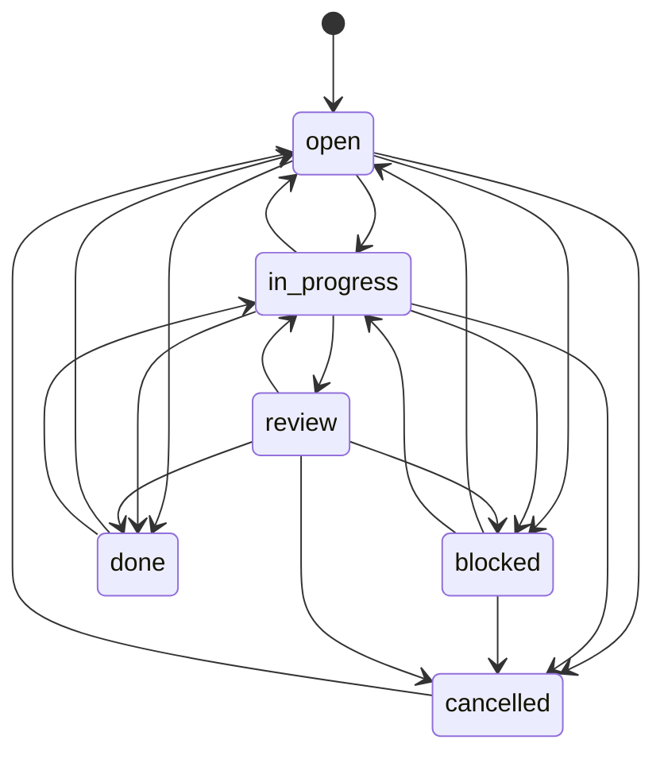

# corvee — Technical Specification (v35)

## 1. Purpose

`corvee` is a single-machine, non-git-tracked, persistent CLI task tracker
that tracks tasks, todos, decisions, and progress within a single
project/workspace, across sessions, for people and AI agents alike,
including several of them working on the same project concurrently. It
keeps a session from losing context and keeps two workers from colliding
mid-task: instead of re-deriving "what was I doing" from chat history, or
silently overwriting another worker's edit, the caller queries and claims
work through `corvee`.

Alongside tracking work, corvee also holds a small, standalone store of
checked-true claims (§4.6), a place to record something as verified with
proof and a date, so a later session can retrieve it and check new output
against it instead of re-deriving or silently hallucinating a fact it
already established once.

## 2. Non-goals

- Not a replacement for GitHub/GitLab Issues, Jira, or Linear. No hosted
  sync, no cross-machine access.
- Concurrency scope is a single machine/filesystem: multiple agents and/or
  humans on one box (separate terminals, processes, or git worktrees), not
  agents on separate machines/containers without a shared filesystem. If
  that changes, revisit the connection model (see §3.2) before anything
  else.
- Task data (the SQLite database) is never committed to git. Only a small,
  non-sensitive project-binding file may live in the repo (§3.1).
- No web UI, no notifications, no built-in scheduling/automation.
- No `corvee delete` command for tasks. Abandoning a task is a state
  transition (`state=cancelled`), and the row and its history stay
  queryable forever. Both tasks and facts get one narrow, deliberate
  exception: `corvee task purge` (§4.5.1) permanently removes an
  already-`cancelled`, unlinked task, and `corvee fact delete` (§4.6)
  permanently removes an already-`retracted` fact. `cancelled`/`retract`
  remain the default, reversible way to abandon a task/fact; `purge`/
  `delete` are for the rarer case where a row should not exist at all any
  more — junk, a typo, a duplicate double-submitted under concurrency —
  and keeping it around forever would only dilute `doctor`'s counts and
  every future listing with something nobody can ever act on again.

## 3. Architecture

### 3.1 Project binding (not the task data itself — the DB is out of the repo)

`corvee init` creates `.corvee/config.toml` in the current directory
(analogous to `.git` — no repo-root auto-detection) holding a single key,
`db_path`, which defaults to `.corvee/corvee.db` next to it. If a
`.gitignore` already exists in that directory, `corvee init` adds a
`.corvee/` entry to it (never creates one from scratch — see §7 for why
`init` treats `AGENTS.md` even more conservatively, never writing to it at
all). `config.toml` carries no task data, just the pointer; it's
git-ignored by default so nothing corvee-related is ever committed, per
the non-goal above, but its absence from git is a convenience default,
not a hard requirement of the design.

**`corvee init` is idempotent.** Re-running it in a directory that already
has `.corvee/config.toml` leaves the config and the database untouched, adds
the `.gitignore` entry only if the file exists and is missing it, and exits
0 reporting what it did and did not do. Truncating an existing database on
a second `init` would destroy a backlog through a command people run
speculatively, so `init` never writes over anything that exists.

**`config.toml` is the only place the database location is declared.**
There is no environment override and no `--db` flag on `task`/`fact`
commands — one source of truth, so two invocations from the same directory
can never disagree about which file they are writing to. A relative
`db_path` resolves against the directory containing `config.toml`, never
against the current working directory, which is what keeps the default
`.corvee/corvee.db` pointing at the same file when a command runs from a
subdirectory. `corvee init --db-path <path>` is the one place that value is
chosen, and only at creation time: it writes `<path>` into `config.toml`
instead of the default, resolved the same way against the config's own
directory (so the worktree-sharing `../../main/.corvee/corvee.db` example
above is exactly what `--db-path` is for). Like every other part of `init`,
it is inert on a re-run against an existing config — the flag is only
consulted while `config.toml` is being created.

The value reaches `config.toml` as a properly escaped TOML string, so a
`--db-path` holding a quote, a backslash, or a control character resolves
back to the file the user named. A path that is not valid UTF-8 (which Linux
filenames allow) has no TOML spelling at all, so `init` refuses it with exit
2 (`invalid_db_path`) before writing anything.

The CLI resolves the project by walking up from the current directory to the
nearest `.corvee/config.toml`, the same way git walks up to find `.git`.
That is what lets a project "just work" from any subdirectory without
re-registering, and it is why a binding file is needed even when the
database sits right next to it — subdirectory resolution and "where's the
data" are separate concerns, and the second one starts to matter the moment
`db_path` points elsewhere.

That is also the whole answer for git worktrees. Each worktree gets its own
`.corvee/config.toml` and therefore its own backlog by default. Worktrees
that should share one backlog point their `db_path` at the same file, which
works because the path is resolved against the config's own directory, so
`../../main/.corvee/corvee.db` from a sibling checkout is stable no matter
where the command runs.

### 3.2 Connection model

No daemon. Each `corvee` invocation opens the SQLite file named by
`.corvee/config.toml` directly, does its work, and closes it. This is
sufficient at the stated concurrency scope (same machine, moderate call
frequency from a handful of agents/humans, not a swarm):

- SQLite runs in WAL mode, so readers never block writers or each other.
- `PRAGMA busy_timeout = 5000` on every connection makes a writer wait
  briefly for another writer to finish instead of failing immediately with
  `SQLITE_BUSY` — the only contention case that exists under WAL.
- Beyond the version check below, each invocation wraps its own work in one
  transaction: `BEGIN IMMEDIATE` for any command that writes, a plain
  `BEGIN` for commands that only read (`task list`, `task show`, `task
  ready`, `task search`, `task mine`, `task labels`, `fact list`, `fact
  search`, `fact show`, `export`, `doctor`). `BEGIN IMMEDIATE` takes the write lock
  up front, before the command's own first read pins a WAL snapshot.
  Without that, a write later in the same transaction can fail with
  `SQLITE_BUSY_SNAPSHOT` if another writer commits in between — a variant
  `busy_timeout` does not retry the way it retries ordinary lock
  contention, so the failure is immediate rather than a brief wait.
  Read-only commands stay on a plain `BEGIN` so they never take a write
  lock and never block a writer.
- Every invocation begins by reading `MAX(version)` from
  `schema_migrations` as a plain read, taking no lock. Three outcomes
  follow. Equal to the version this binary ships means proceed. Lower means
  re-read it under `BEGIN IMMEDIATE` and apply what is missing, so two
  processes racing to migrate serialize on that transaction instead of
  double-applying one. Higher means **refuse and exit 6**, because an older
  binary writing to a schema it does not understand corrupts data that a
  newer one wrote; the message names both versions and says to upgrade.
  Checking before locking is what keeps `corvee task list` off the write
  path entirely, so read commands work against a read-only database and
  never block a writer.
- `PRAGMA foreign_keys = ON` on every connection open. It is off by default
  in SQLite, and without it every `REFERENCES` in §4.1 is decorative.
- Claims (§4.4) are a single conditional `UPDATE`, which SQLite already
  executes atomically — no extra locking needed on top of that.
- **Facts have no claim mechanism (§4.6).** Two actors revising the same
  fact at the same moment both succeed under the transaction model above;
  the second write simply wins, and `fact_events` keeps both attempts as
  separate rows — the only record that a revision got clobbered. This is
  accepted behavior, not a gap: a fact's whole point is convergence on one
  current claim, which last-write-wins reaches without needing an actor to
  coordinate first, unlike a task where two actors' edits genuinely
  conflict.

A daemon would only earn its cost back if concurrency ever needed to span
machines without a shared filesystem. That's the actual problem a broker
process solves, and it's explicitly out of scope (§2).

### 3.3 Local and global scope

Every task and fact lives in exactly one of two databases: the **local**
project database resolved by §3.1, or one **global** database shared
across every project on the machine, at `~/.corvee/corvee.db`. The global
database has no `config.toml` — one fixed path, the same "one source of
truth" reasoning §3.1 gives for the project binding, just without a
pointer file to find it through, since there is only ever one.
`$CORVEE_GLOBAL_DB`, if set, redirects that fixed path to the value given,
taken as-is against cwd with no `expanduser()`/`resolve()`; it is an
internal escape hatch for tests and agent tooling to exercise `--global`
scope without touching a real user's database, never part of the
documented CLI/config surface, and ordinary use never sets it.

**The global database is created lazily, on first use, not by `corvee
init`.** `corvee init` only ever touches the local project (§3.1); nothing
about setting up one project should reach outside it. The first command
that actually needs to write to the global database — `task add --global`,
`fact add --global`, or a mutating command given a
`TASK-GLOBAL-<n>`/`FACT-GLOBAL-<n>` id — creates `~/.corvee/` and the
database file if they do not exist yet, the same schema-bootstrap
`open_connection` already performs for a fresh local database (§4.1). A
read-only command never creates it: if `~/.corvee/corvee.db` does not
exist, the global side of a merged query is simply empty, so listing tasks
in a project that has never filed a global one leaves no trace on disk.

**`--global` marks a task or fact as global at creation time**; there is
no command to move an existing row between scopes, the reversible
equivalent being to file it again in the other scope. Every other command
that takes an id (`show`, `update`, `claim`, `comment`, `verify`, ...)
infers scope from the id itself: `TASK-GLOBAL-<n>`/`FACT-GLOBAL-<n>`
resolve against the global database, `TASK-<n>`/`FACT-<n>` against the
local one (§4.2, §4.6). A command never needs a separate `--global` flag
to operate on a row it already has the id for.

**Listing merges both databases by default; `--scope local|global|all`
narrows it**, default `all`. Local and global tasks/facts share no
primary key space (§4.2), so a merged listing tags each row with a
`scope` key (`"local"` or `"global"`) alongside its already-namespaced
`id`. `--limit` applies to the merged result, not to each database
independently: a merged query fetches every matching row from both
databases, sorts once, then slices — asking each database for `--limit`
rows first and concatenating could drop a row that belonged in the top
`n` merely because it came from whichever database was queried second.
`--limit` requires a positive integer (`click.IntRange(min=1)`); `0` or
negative is a usage error (exit 2), not "unlimited" and not a signal to
slice from the end of the result.

**A missing local project drops out of `--scope all`/`--scope global`
silently, the same way a missing global database already does — it never
requires `corvee init` to have been run somewhere.** Every command whose
`--scope` defaults to `all` (`task list`/`ready`/`search`/`mine`/`claims`,
`fact list`/`search`, `brief`, `doctor`) resolves which scopes to query by
checking existence first (a `.corvee/config.toml` upward from cwd for
local, `~/.corvee/corvee.db` for global) rather than attempting local
unconditionally and letting a missing project raise. This is what makes
`--global` usable for what it was built for — a machine-wide chore, not
tied to any project — from literally anywhere, including a directory that
has never seen `corvee init`: `cd /tmp && corvee task add "renew the CA
cert" --description ... --global` followed by `corvee task mine` from any
other uninitialized directory just works. **`--scope local`, requested
explicitly, is unaffected and keeps failing loudly** (exit 6, `no_project`)
when no project resolves — that's a real usage error, asking by name for
something that structurally cannot exist, not the "just show me global"
case `all`/`global` exist for.

**Cross-scope links are rejected.** `task link` operates within one
SQLite file's foreign keys (§4.1); a local task cannot `blocks` or
`parent_of` a global one or vice versa. Attempting it is a guard
violation (exit 5, `cross_scope_link`), not a new exit code.

Each database keeps its own independent connection, transaction, and
migration lifecycle exactly as §3.2 describes — a merged read opens and
closes two ordinary read-only connections, one per database, never a
cross-database transaction. A command that mutates always touches exactly
one database, since scope is fixed at creation and every id belongs to
one database only, so nothing here changes §3.2's one-transaction-per-write
guarantee.

## 4. Data model

### 4.1 Schema (v1)

```sql
CREATE TABLE schema_migrations (
    version    INTEGER PRIMARY KEY,
    applied_at TEXT NOT NULL
);

CREATE TABLE tasks (
    id          INTEGER PRIMARY KEY AUTOINCREMENT,
    title       TEXT NOT NULL,
    description TEXT NOT NULL DEFAULT '',
    type        TEXT NOT NULL DEFAULT 'task',    -- task|bug|feature|epic|chore|spike
    priority    TEXT NOT NULL DEFAULT 'medium',  -- low|medium|high|critical
    state       TEXT NOT NULL DEFAULT 'todo',    -- todo|in_progress|blocked|review|done|cancelled
    claimed_by  TEXT,                            -- actor string, NULL = unclaimed
    claimed_at  TEXT,                            -- last asserted, see §4.4
    created_at  TEXT NOT NULL,
    updated_at  TEXT NOT NULL,
    assigned_to TEXT                              -- advisory routing, NULL = unassigned, see §4.4
);
CREATE INDEX idx_tasks_state ON tasks(state);
CREATE INDEX idx_tasks_claimed_by ON tasks(claimed_by);
CREATE INDEX idx_tasks_assigned_to ON tasks(assigned_to);

CREATE TABLE labels (
    id   INTEGER PRIMARY KEY AUTOINCREMENT,
    name TEXT NOT NULL UNIQUE   -- stored lowercase/trimmed; enforced on insert
);

CREATE TABLE task_labels (
    task_id  INTEGER NOT NULL REFERENCES tasks(id),
    label_id INTEGER NOT NULL REFERENCES labels(id),
    PRIMARY KEY (task_id, label_id)
);
CREATE INDEX idx_task_labels_label ON task_labels(label_id);

-- Cross-links (blocks/relates_to/duplicates) and hierarchy (parent_of).
-- A task has at most one direct parent and any number of children, so the
-- hierarchy is a forest. That is enforced by idx_one_parent below rather
-- than a parent_id column on tasks, which keeps one traversal path for all
-- four relations. parent_of insertions are cycle-checked (see §4.3).
CREATE TABLE task_links (
    id        INTEGER PRIMARY KEY AUTOINCREMENT,
    source_id INTEGER NOT NULL REFERENCES tasks(id),
    target_id INTEGER NOT NULL REFERENCES tasks(id),
    relation  TEXT NOT NULL,    -- blocks|relates_to|duplicates|parent_of
    CHECK (source_id <> target_id),
    UNIQUE (source_id, target_id, relation)
);
CREATE INDEX idx_task_links_source ON task_links(source_id);
CREATE INDEX idx_task_links_target ON task_links(target_id);

-- At most one parent per task, enforced by the database rather than by a
-- read-then-write check in the CLI, which two concurrent linkers could
-- both pass.
CREATE UNIQUE INDEX idx_one_parent ON task_links(target_id)
    WHERE relation = 'parent_of';

-- One timeline per task, three kinds of row: 'created' (one row, written
-- once when the task is made, new_value holds its title -- the task
-- equivalent of fact_events' own 'created' kind), 'comment' (manual
-- narrative — why), and 'field_change' (automatic audit trail — what
-- changed, written by corvee itself on every mutation, including
-- claim/unclaim and label and link changes; for those, 'field' is 'label'
-- or 'link:<relation>' and the added or removed value sits in new_value or
-- old_value, so an unlink is never silent). One table because corvee show
-- reads them as a single merged, time-ordered feed anyway; splitting them
-- into separate tables would just require a UNION at read time for no
-- benefit.
CREATE TABLE task_events (
    id         INTEGER PRIMARY KEY AUTOINCREMENT,
    task_id    INTEGER NOT NULL REFERENCES tasks(id),
    kind       TEXT NOT NULL,    -- created|comment|field_change
    field      TEXT,             -- set when kind=field_change
    old_value  TEXT,
    new_value  TEXT,             -- title when kind=created
    body       TEXT,             -- set when kind=comment
    actor      TEXT NOT NULL,    -- see §4.4
    session_id TEXT,
    created_at TEXT NOT NULL
);
CREATE INDEX idx_task_events_task ON task_events(task_id);

-- Standalone store of checked-true claims — see §4.6. No foreign key to
-- tasks: a fact is not scoped to one task, and an agent that wants to
-- connect the two does so case by case (e.g. mentioning a fact id in a
-- task comment), not through a schema relationship.
CREATE TABLE facts (
    id          INTEGER PRIMARY KEY AUTOINCREMENT,
    claim       TEXT NOT NULL,
    status      TEXT NOT NULL DEFAULT 'unverified',  -- unverified|verified|retracted
    verified_at TEXT,             -- last verification; NULL unless status='verified'
    verified_by TEXT,             -- actor who last verified
    proof       TEXT,             -- current proof text; NULL unless status='verified'
    created_at  TEXT NOT NULL,
    updated_at  TEXT NOT NULL
);
CREATE INDEX idx_facts_status ON facts(status);

-- Immutable revision history for facts, mirroring task_events. One row per
-- action rather than per field, since a fact has exactly one mutable field
-- (its claim text) plus a status that moves alongside it.
CREATE TABLE fact_events (
    id         INTEGER PRIMARY KEY AUTOINCREMENT,
    fact_id    INTEGER NOT NULL REFERENCES facts(id),
    kind       TEXT NOT NULL,   -- created|revised|verified|unverified|retracted
    old_value  TEXT,            -- old claim text, for 'revised'
    new_value  TEXT,            -- new claim text, for 'created'/'revised'
    proof      TEXT,            -- locator/evidence text, for 'verified'
    note       TEXT,            -- free-text reason, for 'unverified'/'retracted'
    actor      TEXT NOT NULL,
    session_id TEXT,
    created_at TEXT NOT NULL
);
CREATE INDEX idx_fact_events_fact ON fact_events(fact_id);
```

**Schema v2** renames the `todo` task state to `open` (§4.5): `UPDATE tasks
SET state = 'open' WHERE state = 'todo'`. The DDL above stays exactly as
`v1` wrote it — this section documents migration history, not a live
snapshot — and a database still at `v1` picks up the rename automatically
the next time any command opens it (§3.2).

**Schema v3** adds `tasks.assigned_to` and its index (`ALTER TABLE tasks
ADD COLUMN assigned_to TEXT`, `CREATE INDEX idx_tasks_assigned_to ON
tasks(assigned_to)`) — advisory routing, distinct from `claimed_by`, see
§4.4.

Timestamps are fixed-width UTC ISO-8601 with milliseconds
(`2026-09-11T14:03:22.123Z`), so plain text sorting matches chronological
order, and ties break on `id`/rowid. Every timestamp in the schema comes
from one shared helper — `datetime.isoformat()` emits microseconds and a
`+00:00` offset, both of which break the fixed-width property, so no code
path formats a timestamp on its own.

`tasks.updated_at` advances on any write that produces a `task_events` row
for that task, comments and label and link changes included, not only on
column writes. "Last touched" is the useful reading for an agent resuming
work, and a task whose only activity this week was a handoff comment has
genuinely been touched. `facts.updated_at` follows the same rule against
`fact_events`.

State/priority/type/relation/status stay free `TEXT` rather than SQL
`CHECK` enums, because SQLite can't cheaply alter a `CHECK` constraint
later (requires a table rebuild) and this schema is explicitly expected to
evolve. Validation of allowed values happens in the CLI layer (one shared
constants module), which is also where a new value gets added when the
enum grows — no migration needed for that case. Renaming or removing an
existing value is different: rows on disk still carry the old literal, so
that needs an actual data migration (`UPDATE ... SET column = 'new' WHERE
column = 'old'`) bumping `CURRENT_SCHEMA_VERSION`, the same way schema v2
renamed the `todo` state to `open` above. `facts.status` follows the
free-`TEXT` rule for the same reason: a boolean would conflate "never
checked" with "checked and wrong," and a third status has already been
needed once (`retracted`, added alongside `unverified`/`verified` from the
start).

### 4.2 Task IDs

Tasks are referenced externally as `TASK-<n>` (e.g. `TASK-14`), where `<n>`
is the raw integer primary key. Commands accept either `TASK-14` or bare
`14` and normalize internally; anywhere IDs are sorted, sort on the integer,
never the string. `TASK-<n>` is unique within one database, not globally —
a local project database holds one project's tasks; the global database
(§3.3) holds the one shared backlog `--global` files into.

**A task in the global database (§3.3) is referenced as `TASK-GLOBAL-<n>`**,
its own id space, distinct from every project's `TASK-<n>`. A bare integer
is ambiguous between the two and is always resolved as local — reaching a
global task requires the full `TASK-GLOBAL-<n>` form. Parsing follows the
same rule as the `FACT-<n>` guard below: a `fact` command given a
`TASK-GLOBAL-<n>` value rejects it pointing at `corvee fact show`.

**The `id` key in every JSON task object is the `TASK-<n>`/`TASK-GLOBAL-<n>`
string**, not the bare integer — the same form documented above and the
same form every command accepts back as input, so an agent never has to
reformat an id between reading it and using it in the next call.

Facts use a separate id space, `FACT-<n>`, with its own normalization and
sorting rules — see §4.6.

### 4.3 Parent/child rules

- A task cannot transition to `state=done` while any of its children
  (`task_links` rows where `relation='parent_of'` and `source_id` = this
  task) are in a state other than `done` or `cancelled`. `corvee task
  update` rejects such a transition and lists the blocking subtask IDs.
  Re-opening a child of an already-`done` parent is allowed (the parent
  isn't retroactively invalidated) but surfaces a `warnings` key (a list of
  strings) on the child's object, whichever surface performs the reopen
  (`corvee task update --state open`, or `task_reopen` over MCP).
  `corvee task link <parent> <child> --relation parent_of` carries the
  same warning, on the parent's object instead, when the child being
  attached is non-terminal and the parent is already `done` — neither case
  changes anyone's state, only the JSON.
- **A task has at most one direct parent.** `corvee task link <parent>
  <child> --relation parent_of` fails with a guard error if `<child>`
  already has a parent, naming the current one and pointing at `corvee task
  unlink`. Moving a subtask is therefore an explicit unlink followed by a
  link, never an implicit re-parent hidden inside a link call. The
  constraint lives in the `idx_one_parent` partial unique index (§4.1) and
  not only in the CLI check, because two agents linking the same child to
  different parents at the same moment would both pass a read-then-write
  check.
- Cancelling a parent cascades. `corvee task update <parent> --state
  cancelled` is rejected outright while any child is still open, listing
  them, the same way `done` is. With `--cascade` it cancels the parent and
  every descendant that is not already `done`, walking the subtree, writing
  a `field_change` event per affected task, clearing their claims under the
  terminal-state rule (§4.4), and listing every ID it touched in the
  output. Children already in `done` keep that state, since a finished
  piece of work stays finished even when the surrounding effort is
  abandoned. A descendant actively claimed by another actor blocks the
  whole cascade with the same exit-4 claim conflict a named task would
  raise — `--cascade` authorizes touching unclaimed descendants
  structurally, not stealing a live foreign claim on one of them.
- **`--cascade` is a separate flag from `--force`, deliberately.** `--force`
  overrides another actor's claim, whether on the task named in the command
  or on a descendant `--cascade` reaches; `--cascade` authorizes writes to
  tasks the caller never named. The exit-4 message points at `--force` by
  design, so an agent that hits a claim conflict reaches for that flag
  mechanically — and if the same call happens to be `--state cancelled` on a
  parent, one bundled flag would cancel a subtree nobody looked at. A call
  blocked by both a foreign claim and open children needs both flags, which
  is the honest reading of two independent overrides.
- `parent_of` links must not form a cycle. To validate a new link
  `corvee task link <parent> <child> --relation parent_of`, walk the *new
  parent's* ancestor chain (repeatedly follow `parent_of` edges upward:
  given node X, its parent is the single `source_id` where `target_id = X`)
  and reject the link if the *new child* appears on that chain. Concretely,
  if `A parent_of B` and `B parent_of C` already exist, then attempting
  `corvee task link C A --relation parent_of` walks ancestors(C) = [B, A],
  finds A, and rejects — this is the check that must run on the new
  parent's ancestors, not the new child's, or a cycle like this one slips
  through undetected. Single parenthood makes that walk a chain rather than
  a search, but it still runs iteratively with a `visited` set so that a
  cycle already present in a hand-edited database terminates the loop
  instead of hanging it.
- `corvee task unlink <source-id> <target-id> --relation <r>` removes a
  link. Needed because a mistyped `parent_of` would otherwise permanently
  block the parent from reaching `done` with no way to fix it through the
  CLI.
- `blocks` carries no automatic guard (unlike `parent_of`) — it's advisory
  input to `corvee task ready` (§5), not enforced on `corvee task update`.
  It is still cycle-checked on insert, reusing the same walk as
  `parent_of` over `blocks` edges. `A blocks B` plus `B blocks A` would
  drop both tasks out of `corvee task ready` permanently while every
  command still reports success, which is the worst failure mode available
  here — silent, and invisible from the task's own detail view.
- `relates_to` is symmetric, so it is stored as a single row normalized to
  `source_id < target_id` and displayed on both ends in `corvee task show`.
  Normalizing on insert is what makes the `UNIQUE (source_id, target_id,
  relation)` constraint actually collapse `link A B` and `link B A` into one
  row; storing them raw would allow both and render the relation twice on
  each task. `blocks`, `duplicates` and `parent_of` are directional and are
  stored as given.

### 4.4 Actor identity and claims

Two values identify the caller, and they are deliberately separate.

- **Actor** is the **stable** identity of an agent or human
  (`agent:claude`, `human:btschwertfeger`), unchanged across restarts and
  sessions. If unset, `human:$USER` is used, so interactive shell use needs
  no setup. This replaces a generic `'agent'|'human'` enum — with real
  concurrency, distinguishing *which* agent matters, not just that it was
  an agent.
- **Session id** is the **volatile** per-session token
  (`claude-session-7`). It is optional, defaults to NULL, and corvee stamps
  it onto every `task_events`/`fact_events` row an invocation writes,
  comments and field_changes alike.

**The `human:$USER` fallback is a single shared identity, not a
distinguishing one.** Two sessions on the same machine that both skip
setting `CORVEE_ACTOR` — an ordinary slip, not a misconfiguration — resolve
to the identical actor string, so a claim taken by the second looks to
`claim_task` like the first actor's own heartbeat (above) rather than a
conflict, and both proceed to edit the same task at once: exactly the
collision claims exist to prevent. Corvee does not change that default
(`human:$USER` still needs no setup for the single-session case it was
built for) or try to invent a substitute identity for the fallback path,
since nothing about a bare, unconfigured invocation distinguishes one
session from another. Instead `doctor` (§5.5.1) makes the failure
detectable after the fact: a currently-claimed task whose claimant's own
recent activity carries more than one session id is exactly this
signature. Setting `CORVEE_ACTOR` explicitly is what prevents it outright,
and is expected the moment more than one session might touch a backlog
concurrently.

Each can be set two ways, with the global `--actor`/`--session-id` options
(available on `corvee` itself, before the subcommand) taking precedence
over the `CORVEE_ACTOR`/`CORVEE_SESSION_ID` environment variables:
`corvee --actor agent:claude --session-id session-42 task list --json`.
The flags exist for the same value as the env vars but as literal argument
text rather than a shell assignment — an agent harness with a permission
allowlist that matches on the literal command (e.g. anything starting with
`corvee`) cannot match `CORVEE_ACTOR=agent:claude corvee task list` or
`export CORVEE_ACTOR=... && corvee task list`, since the command text
does not start with `corvee` and a compound command needs a rule per
sub-command; `corvee --actor agent:claude task list` has no such problem.
Both mechanisms resolve to the same values everywhere in the codebase,
including commands like `task mine` that read the actor outside
`corvee_context`.

Claims key off the stable actor only. An agent whose session dies mid-task
reclaims its own work on the next run as a no-op success, and
`corvee task list --claimed-by agent:claude` still finds it after a
restart. Folding the session token into the actor string would make every
restart a different claimant, so resuming yesterday's own task would need
`--force` and no filter could find it. The session token still records
*which run* touched a task, which is what makes an event timeline readable
when the same agent has worked a task across several sessions.

**A claim means "an actor is working on this right now", nothing weaker.**
It is not an assignment, not a reservation, and not an ownership record. A
task nobody is touching at this moment is unclaimed, which is what makes
`--unclaimed` a truthful answer to "what can I pick up". Two consequences
follow directly. `corvee task add` never claims the task it creates, because
filing work and starting it are separate acts. And an actor that stops work
without finishing calls `corvee task unclaim`, the same way it would release
any lease.

**`assigned_to` fills the gap a claim deliberately leaves: routing a task
to a specific actor without asserting anyone is working on it.** A human
or a supervising agent directing a fleet needs to say "agent:B, take this
one" without making it look actively in-progress, which claiming on B's
behalf would do, muddying `--stale` and `doctor`'s counts with a claim
that is not really live work. `corvee task assign <id> [<id> ...] --to
<actor>` sets it and `corvee task unassign <id> [<id> ...]` clears it,
both in one transaction across multiple ids like `claim`/`unclaim`.
Neither is claim-gated in either direction: assigning a task someone else
already claims succeeds (it is metadata about intent, not a lock on the
content), and assigning never itself claims the task. It is also kept
entirely out of the transition/guard machinery, the same way labels sit
outside the claim/state system — reassigning overwrites the previous
value with no history check, and the change is still recorded as an
ordinary `field_change` event in `task_events`. `task list --assigned-to
<actor>` filters by it, and `task mine` (§5.1.1) treats "claimed by me" OR
"assigned to me and not yet claimed by anyone" as the same "what's mine"
answer, since an assignment stops being the operative signal the moment
an actual claim exists.

Claiming is hard-enforced for edits: `corvee task update <id>` fails if the
task is claimed by a *different* actor, with a message pointing at
`--force`. Updating an *unclaimed* task does not fail. It takes the claim,
applies the change, and releases it again inside one transaction, recording
the claim/unclaim pair in `task_events` like any other change. A transient
claim keeps the conflict check intact (a task actively held by someone else
still rejects the write) without forcing a claim/update/unclaim dance on a
human re-prioritizing a backlog item, and without leaving a claim behind
that would falsely read as "someone is working on this". A `--state
in_progress` update is the one case that keeps the claim rather than
releasing it, since that transition is the actor saying work has started.

`update` is the only claim-gated command. `comment`, `label`, `link` and
`unlink` are open to any actor at any time. A claim guards the task's own
content against two actors editing it at once, and none of those four
commands touch that content. Gating them would also block the most useful
thing a second agent can do with someone else's in-flight task, which is
leave a note on it. **Facts have no equivalent gate at all** — §4.6 and
§3.2 cover why claiming does not apply to them.

- `corvee task claim <id> [<id> ...] [--force]` — atomically sets
  `claimed_by = $CORVEE_ACTOR`, `claimed_at = now` where `claimed_by IS
  NULL` (a conditional `UPDATE`, checked by rows-affected — this is the
  whole concurrency-safety mechanism for claiming; SQLite executes the
  `UPDATE` atomically and `busy_timeout` handles a competing writer, so no
  locking beyond that is needed). A repeat claim by the same actor
  succeeds and refreshes `claimed_at` (see below). Claiming a task already
  held by a different actor fails unless `--force`, which steals the claim
  and records the previous claimant in `task_events`. **Claiming a task
  already in a terminal state (`done`/`cancelled`) always fails** (guard
  violation, exit 5, `task_terminal`), `--force` included — a finished task
  is not "about to be worked on", and force only overrides a conflicting
  claimant, not a task being finished. Without this, a done task could
  carry a live, never-stale claim indefinitely, the same drift the terminal
  clear below exists to prevent. Multiple ids apply in one transaction,
  all-or-nothing, the same as `task update`.
- `corvee task unclaim <id> [<id> ...]` — clears `claimed_by`/`claimed_at`.
  Only the current claimant may do this without `--force`. Multiple ids
  apply in one transaction, all-or-nothing.
- `corvee task update <id> --state ... [--force]` — rejects a claim held by
  another actor, takes a transient one when the task is unclaimed, per the
  paragraphs above.
- `corvee task start <id> [<id> ...] [--force]` — `corvee task update <id>
  --state in_progress [--force]` under a name that says what it is for. No
  separate claim step and no new guard logic: it is the existing transient-
  claim-kept-for-`in_progress` rule (above) reached through one call instead
  of two, so it follows `update`'s claim-conflict (exit 4) and transition
  (exit 5) rules exactly, including the `done` → `in_progress` transition
  that `update` already permits. It deliberately does not route through
  `claim`'s stricter `task_terminal` check, which would reject a `done` task
  outright and make `start` unable to do something `update` already does.
  Multiple ids apply in one transaction, all-or-nothing, the same as
  `claim`/`update`.
- `corvee task assign <id> [<id> ...] --to <actor>` — sets `assigned_to`,
  not claim-gated in either direction (§4.4). Reassigning to a different
  actor overwrites the previous value; assigning to the actor already
  holding it is a no-op. Multiple ids apply in one transaction,
  all-or-nothing, the same as `claim`/`unclaim`.
- `corvee task unassign <id> [<id> ...]` — clears `assigned_to`. A no-op
  success if already unassigned. Multiple ids apply in one transaction,
  all-or-nothing.

Reaching a terminal state (`done` or `cancelled`) clears
`claimed_by`/`claimed_at` in the same transaction, recorded as a normal
`field_change` event. Without that, every finished task stays attributed to
whoever last touched it and `--unclaimed` slowly stops meaning anything.

A crashed agent leaves behind a claim that asserts active work nobody is
doing, so under the lease reading above that stale claim is a false
statement the next agent has to resolve. Claims still never expire on their
own. There is no TTL and no heartbeat, because
both need a notion of liveness that a connect-do-work-close CLI does not
have — a long-running agent that holds a task for six hours is
indistinguishable from a crashed one at the data layer. Instead staleness is
*surfaced*, and a human or another agent decides: `corvee task list --stale
[<duration>]` lists tasks whose `claimed_at` is older than the given
duration (default `4h`), which is the input to a deliberate `claim --force`.

**`claimed_at` means "claim last asserted", not "claim first taken"**, which
is what makes the 4h window survivable for work that genuinely takes longer.
It is refreshed by any of three things, all of which happen during normal
work.

- A repeat `corvee task claim <id>` by the current claimant. This is the
  explicit heartbeat, one cheap call, and it is why re-claiming is a
  success rather than an error.
- A `corvee task update <id>` by the current claimant.
- A `corvee task comment <id>` by the current claimant. Comments from
  anyone else do not touch it, since a bystander's note is no evidence that
  the claimant is still alive.

An agent working a task for a full day therefore stays out of `--stale` by
doing what it was already doing, and only silence for four hours flags it.
The moment the claim was first taken stays recoverable from the
`field_change` row in `task_events`, so redefining the column loses nothing.

### 4.5 State transitions

Transitions are restricted, and the permitted set is data rather than
branching logic — a single `dict[State, frozenset[State]]` in the same
constants module that holds the value lists (§4.1), consulted by one guard
function. Changing policy later is then an edit to that table, with no way
for a second code path to disagree with it.

| From | May move to |
|---|---|
| `open` | `in_progress`, `blocked`, `done`, `cancelled` |
| `in_progress` | `open`, `blocked`, `review`, `done`, `cancelled` |
| `blocked` | `open`, `in_progress`, `cancelled` |
| `review` | `in_progress`, `blocked`, `done`, `cancelled` |
| `done` | `open`, `in_progress` |
| `cancelled` | `open` |



Setting a task to the state it already holds is a no-op success, not a
rejection, so a retrying agent is never punished for being unsure. A
rejected transition exits 5 and names the states reachable from the current
one, which is enough for an agent to correct itself without reading docs.

Four rejections carry intent worth stating. `blocked` cannot jump straight
to `done` or `review`, so finishing work always passes back through
`in_progress` and the timeline shows when the blocker actually cleared.
`done` cannot go to `cancelled`, and `cancelled` cannot go anywhere except
`open`, so reviving abandoned work re-enters the flow at the top instead of
resuming mid-stream from a terminal state.

The parent/child guard (§4.3) and the cancel cascade layer on top of this
table. A transition has to be permitted here *and* satisfy those rules.

Facts have no comparable transition table — §4.6 covers the much smaller
set of rules that govern `status`.

#### 4.5.1 `task purge`

`cancelled` is reachable from every non-terminal state and reversible
(`cancelled` → `open`), but it is still a live row: counted in `doctor`'s
totals, listed under `task list --all`, and shipped in every `export`
dump, forever (§2). A long-lived, multi-agent backlog accumulates genuine
junk — a typo, a duplicate filed twice under concurrent claiming, a
throwaway test task — that nobody can ever remove, so those counts and
listings only ever dilute over the project's lifetime.

`corvee task purge <id> [<id> ...]` permanently removes a task and its
entire `task_events` history: the task analogue of `corvee fact delete`
(§4.6), and the same two-step shape. It only works when the task's current
`state` is `cancelled` — cancel is always the reversible first step,
exactly like retract-then-delete for a fact — and only when the task
carries no `task_links` in either direction, as source or target of any
relation. The link check has no fact equivalent, because a fact has no
links at all: removing a task that still has a `parent_of`/`blocks`/
`relates_to`/`duplicates` edge would silently orphan a live reference on
the other end, so purge fails with a guard violation (exit 5,
`task_has_links`) pointing at `corvee task unlink` rather than dropping
the link implicitly. Calling it on a task that is not yet `cancelled`
fails the same way (`task_not_cancelled`), naming `corvee task update
--state cancelled` as the required first step. Multiple ids apply in one
transaction, all-or-nothing, the same as `claim`/`unclaim`/`assign`; the
response is each purged task's last state, since no row is left to
`corvee task show` afterward. `doctor`'s totals and every listing/export
reflect the removal immediately, since both read the `tasks` table
directly rather than caching a count.

### 4.6 Facts

A fact is a standalone, checked-true (or not-yet-checked, or retracted)
claim, deliberately minimal: a claim, a status, and a revision history. It
carries none of a task's machinery — no labels, no links, no parent/child,
no claiming — because none of that applies to a knowledge record the way it
does to work being actively done. Facts are not linked to tasks in the
schema (§4.1's `facts` table has no foreign key toward `tasks`); an agent
that wants to connect the two decides case by case how, for example by
mentioning a fact's id in a task comment — a mention `task show`/`fact
show` then surface as `referenced:` (§5.1.3), computed at render time
rather than stored, so this non-goal stays intact.

**Facts are referenced externally as `FACT-<n>`**, e.g. `FACT-7`, following
the same rules as `TASK-<n>` (§4.2): commands accept `FACT-7` or bare `7`
and normalize internally, sorting is always on the integer, and the `id`
key in every JSON fact object is the `FACT-<n>` string. Because both id
parsers otherwise accept a bare integer, the two id spaces would be
silently ambiguous without an explicit guard: a `fact` command given a
`TASK-<n>` value rejects it with a message pointing at `corvee task
show`, and a `task` command given a `FACT-<n>` value rejects it pointing at
`corvee fact show`.

**A fact in the global database (§3.3) is referenced as `FACT-GLOBAL-<n>`**,
mirroring `TASK-GLOBAL-<n>`: its own id space, resolved against
`~/.corvee/corvee.db` rather than the local project database, and rejected
by a `task` command with the same wrong-namespace message.

**`status` is `unverified`, `verified`, or `retracted`.** Unlike a task's
`state`, there is no transition table — `verify`, `unverify`, `revise` and
`retract` are all valid from any status, since a fact never needs to
"pass through" one status to reach another the way a task's workflow does.

- `corvee fact add <claim> [--proof <text>]` — creates a fact with
  `status='unverified'`, writing a `created` event. Passing `--proof`
  verifies it immediately in the same call (`created` then `verified`
  events), closing the gap of a mandatory two-call "add, then verify" flow
  for the common case of adding something already known to be true.
- `corvee fact verify <id> --proof <text>` — sets `status='verified'`,
  `verified_at = now`, `verified_by = $CORVEE_ACTOR`, `proof = <text>`, and
  writes a `verified` event. **Re-verifying an already-verified fact
  succeeds and refreshes the proof and timestamp** — the heartbeat
  analogue for facts, and arguably the core value of a date-stamped store:
  checking something again later and recording that it was checked.
- `corvee fact unverify <id> [--note <text>]` — sets `status='unverified'`,
  clears `verified_at`/`verified_by`/`proof`, and writes an `unverified`
  event carrying `--note` if given (why the verification no longer holds).
- `corvee fact revise <id> <new-claim>` — changes `claim`. **Revising with
  text identical to the current claim is a no-op success** (no event, no
  status change), the same "setting to what it already is" convention used
  for task state and labels. Revising to genuinely *different* text writes
  a `revised` event (old and new claim text) and, if the fact's status was
  `verified` or `retracted`, also resets it to `unverified` and writes a
  second event, `unverified` — a changed claim invalidates whatever proof
  verified the old text, and revising a retracted fact's text is itself a
  signal that it should re-enter the normal flow rather than stay
  withdrawn. Writing both events (rather than a single combined one) means
  a reader scanning `fact_events` for `kind IN ('verified', 'unverified')`
  gets the right answer without special-casing `revised`.
- `corvee fact retract <id> [--reason <text>]` — sets `status='retracted'`
  and writes a `retracted` event carrying `--reason` if given. This is the
  graceful exit for a fact that should never have been added: `revise`
  would rewrite the claim, recording a false "used to say X" history for
  something that was wrong from the start, and `unverify` just parks it
  next to every never-checked fact forever, since `fact list` shows
  everything by default. A retracted fact drops out of the default `fact
  list` (included with `--all`), the facts equivalent of a cancelled task
  dropping out of the default `task list`. It is not a dead end: `verify`,
  `unverify` and `revise` all work on a retracted fact too and move it back
  into the normal flow, the same way a cancelled task can return to `open`.
- `corvee fact delete <id>` — **permanently removes** a fact and its entire
  `fact_events` history: the one exception to §2's no-delete rule, and the
  only fact command that leaves nothing behind, not even an event, since
  there is no longer a `fact_id` for one to reference. Only works when the
  fact's current status is `retracted`; called on any other status it fails
  with a guard violation (exit 5, `fact_not_retracted`) naming `corvee fact
  retract` as the required first step. This two-step requirement is
  deliberate: retract is reversible and queryable, so it is always the
  first move for a fact that should not have been added, and requiring it
  before `delete` means nothing is ever hard-removed without first passing
  through a state where its removal was visible and undoable. Returns the
  fact's last state *before* deletion — the one command in the `fact` group
  that cannot return a post-mutation state, because after this call there
  is no row left to describe.

`verified_at`, `verified_by` and `proof` on `facts` **denormalize current
state**, so `fact list`/`fact search` can show "verified when, with what
proof" without a per-row `fact show` — the same split tasks already use
(`claimed_by`/`claimed_at` on `tasks`, full history in `task_events`). All
three clear whenever status leaves `verified` (on `unverify`, on a
claim-changing `revise`, or on `retract`). `--verified-by <actor>` on
`fact list`/`fact search` filters on that denormalized column, mirroring
`--claimed-by` on `task list` — auditing your own prior verifications, or
checking what another actor vouched for before trusting it, without
dumping every fact and filtering client-side.

Facts carry no concurrency control beyond what §3.2 already describes: no
claiming, and a revision from one actor can overwrite another's uncommitted
edit with only `fact_events` recording that it happened.

## 5. CLI Commands

Commands are grouped under three subcommand groups plus a handful of
project-wide top-level commands. `corvee task <verb>` covers everything in
§4.1–§4.5 (create, query, mutate, claim, label, link). `corvee fact <verb>`
covers §4.6. `corvee mcp serve` (§10) exposes the same task/fact
operations over the Model Context Protocol instead of one-shot CLI
invocations, for a host that speaks MCP natively. `corvee init`, `corvee
brief`, `corvee export`, `corvee import`, `corvee doctor`, `corvee
explain`, `corvee completion` and `corvee --version` stay top-level, since
they operate on the whole project (or the binary itself) rather than one
row type:

```
corvee
├── --version
├── init / brief / explain / export / import / doctor / completion
├── task
│   ├── add / list / ready / search / mine / show / update
│   ├── claim / unclaim / start / label / labels / comment
│   └── link / unlink / tree
├── fact
│   ├── add / revise / verify / unverify / retract / delete
│   └── list / search / show
└── mcp
    └── serve
```

All commands emit human-readable table output by default. Every command
accepts `--json`, mutating ones included, except `explain`, `completion`,
and `mcp serve`, which have no `--json` flag, and `export`, which always
writes JSON without needing one.

**Success output is always a JSON array of objects on stdout, uniform
within a command group**, one element per affected row, whether the command
read or wrote. Every task and fact object carries a `scope` key
(`"local"` or `"global"`, §3.3) alongside its already-namespaced `id`, in
every command, not only listings — one uniform shape rather than a key
that appears only when a query happens to merge both databases. Under
`task`: `corvee task add --json` returns the created task (this is how an
agent learns the new ID), `corvee task
claim`/`update`/`label`/`comment` return the affected task in its
post-mutation state, and `corvee task link`/`unlink` return both endpoints.
`corvee task show --json` returns the same task objects with four extra
keys per element (`labels`, `links`, `subtasks`, `events`), and `corvee
task mine` adds one (`last_comment`, null when the task has none), so both
are supersets of the common shape rather than second shapes. Under `fact`:
`corvee fact add --json` returns the created fact, and `corvee fact
verify`/`unverify`/`revise`/`retract` return the affected fact in its
post-mutation state; `corvee fact show --json` adds one extra key,
`events`. `corvee fact delete` is the one exception: it returns the
deleted fact's *last* state, since there is no post-mutation state for a
row that no longer exists (§4.6). An agent parsing either array never
needs a per-command branch beyond that one documented case. Commands that
legitimately affect nothing (`task list`/`fact list` with no match) return
`[]`. One key is genuinely optional rather than a fixed part of the shape:
`warnings`, a list of strings, present on a task object only when
`task update`/`task link` flags one of the advisory oddities in §4.3 (it
is never a reason to reject the write, so its absence is not itself
meaningful — a caller that doesn't check for it loses nothing).

A few commands step outside that shape because what they return is not a
task or a fact. `corvee task labels --json` yields an array of `{"name":
..., "task_count": ...}`; `corvee task claims --json` yields an array of
`{"actor": ..., "scope": ..., "count": ..., "oldest_claimed_at": ...}`,
oldest first. `corvee export`, `corvee doctor --json`, `corvee brief --json`,
`corvee init --json`, and `corvee task tree --json` each yield a single
JSON object rather than an array, since a backup, a stats report, a
session snapshot, a bootstrap report, and a subtree are all documents, not
flat query results (§3.1, §5.1.2, §5.4, §5.5, §5.8).

**Failure writes a JSON object to stderr and nothing to stdout**, so a
caller can parse stdout unconditionally. The object is
`{"error": {"code": "<stable-slug>", "message": "<human text>", ...}}`,
where `code` is machine-stable and `message` is not. Extra keys carry the
detail the agent needs to recover without a second query, for example
`claimed_by` on a claim conflict and `blocking_ids` on a parent/child guard
violation. Free-text-only errors would force agents to string-match, which
breaks on the first reworded message.

Exit codes are distinct enough to branch on without parsing at all.

| Code | Meaning |
|---|---|
| 0 | Success |
| 1 | Unexpected/internal error |
| 2 | Usage or validation error (bad flag, unknown `--fields` name, invalid state, cross-namespace id, malformed `--stale`/`--since` duration, `corvee import` of malformed JSON or a dump missing `schema_version`) |
| 3 | Task or fact not found |
| 4 | Claim conflict (task held by another actor) |
| 5 | Guard violation (open children, `parent_of` cycle, rejected transition, claiming an already-terminal task, `fact delete` on a non-retracted fact, `task purge` on a non-cancelled or still-linked task, cross-scope link) |
| 6 | Project/config problem (no or unreadable `.corvee/config.toml`, a database file that cannot be opened or written, a `.corvee/` or database directory that cannot be created, schema newer than this binary, `corvee import` of a dump whose schema_version doesn't match this binary's) |

### 5.1 `task` commands

| Command | Purpose |
|---|---|
| `corvee task add <title> --description <text> [--type] [--priority] [--label] [--parent <id>] [--global]` \| `corvee task add --from-file <path> [--global]` | Create a task, or a whole batch from a JSON file in one transaction (below). `--global` files into the global database (§3.3) instead of the local project |
| `corvee task list [--state] [--type] [--priority] [--label] [--parent <id>] [--blocks <id>] [--blocked-by <id>] [--relates-to <id>] [--claimed-by <actor>] [--unclaimed] [--assigned-to <actor>] [--stale [<duration>]] [--since <duration>] [--all] [--scope local\|global\|all] [--after <id>] [--limit <n>] [--fields <col,col,...>]` (alias: `ls`) | List tasks with full filtering and column projection. Default excludes `done`/`cancelled`; `--all` includes them. `--scope` defaults to `all`, merging local and global (§3.3) |
| `corvee task ready [--label] [--scope local\|global\|all] [--after <id>] [--limit <n>] [--fields ...]` | Unclaimed open tasks with no open `blocks` predecessor — "what can actually be started right now" |
| `corvee task search <text> [--all] [--include-comments] [--scope local\|global\|all] [--after <id>] [--limit <n>] [--fields ...]` | Tasks whose title or description contains `<text>`, case-insensitive. `--include-comments` also matches comment bodies |
| `corvee task mine [--scope local\|global\|all] [--limit <n>] [--fields ...]` | Open tasks claimed by `$CORVEE_ACTOR`, plus open unclaimed tasks assigned to it (§4.4), each with its last comment — the session-resume query |
| `corvee task show <id> [<id> ...] [--since <duration>] [--no-events]` | Full detail for one or more tasks: description, labels, links, subtasks, and the merged event timeline |
| `corvee task update <id> [<id> ...] [--state] [--type] [--priority] [--title] [--description] [--force] [--cascade]` | Mutate one or more tasks in a single transaction (rejects a claim held by another actor, enforces the transition table and the parent/child guard, writes `task_events` rows) |
| `corvee task claim <id> [<id> ...] [--force]` | Claim one or more tasks for `$CORVEE_ACTOR`, or refresh a claim already held, in one transaction |
| `corvee task unclaim <id> [<id> ...] [--force]` | Release one or more claims, in one transaction |
| `corvee task start <id> [<id> ...] [--force]` | Claim and set `--state in_progress` in one call, in one transaction (§4.4) |
| `corvee task assign <id> [<id> ...] --to <actor>` | Route one or more tasks to `<actor>`, not claim-gated, in one transaction (§4.4) |
| `corvee task unassign <id> [<id> ...]` | Clear the assignment on one or more tasks, in one transaction |
| `corvee task claims [--scope local\|global\|all]` | Actors currently holding a live claim, grouped with a count and the oldest `claimed_at` — multi-agent visibility, distinct from `doctor`'s single aggregate `claimed` count |
| `corvee task label <id> [<id> ...] --add <name> --remove <name>` | Manage labels on one or more tasks in one transaction; both flags repeatable and combinable in one call |
| `corvee task labels` | List every label in the local project with its task count. Labels are not merged across scope (§3.3): a global task's labels live in the global database and are not visible here |
| `corvee task comment <id> <text>` | Append a progress/handoff note (session stamped from `CORVEE_SESSION_ID`) |
| `corvee task link <source-id> <target-id> --relation blocks\|relates_to\|duplicates\|parent_of` | Relate two tasks, including hierarchy (cycle-checked for `parent_of`). Both ids must share one scope (§3.3); a local/global pair is a guard violation |
| `corvee task unlink <source-id> <target-id> --relation <r>` | Remove a link |
| `corvee task tree <id> [--json]` | The full `parent_of` subtree rooted at `<id>`, as an indented tree (or nested JSON, §5.1.2) rather than a flat row set |
| `corvee task purge <id> [<id> ...]` | Permanently remove one or more already-`cancelled`, unlinked tasks and their event history, in one transaction (§4.5.1) |

`--fields` keeps a session's opening query cheap: `corvee task list --fields
id,title --json` returns only those keys per object (still a JSON array of
objects, never bare tuples, so the shape stays uniform). It accepts a fixed
allow-list of flat columns (`id`, `title`, `description`, `type`,
`priority`, `state`, `claimed_by`, `claimed_at`, `assigned_to`,
`created_at`, `updated_at`, `scope`) and rejects an unknown field name with
a non-zero exit and the valid list; labels, links, events, and `task
mine`'s `last_comment` stay out
of projection and require `corvee task show`/`task mine` itself.
Table (non-JSON) output also respects `--fields`, showing only the
requested columns. Without `--fields`, table output on `list`/`ready`/
`search`/`mine` and their fact equivalents uses a narrower default than
the `--fields` allow-list: `description` (tasks) and `proof` (facts) are
dropped, since a long free-text value is what blows a fixed-width row
past a normal terminal's width; `--fields description`/`--fields proof`
still shows it on request. `--json` is unaffected — it always returns the
full row shape regardless of table defaults.

`corvee task show`/`corvee fact show` always return full detail, and
render it differently from the other commands' fixed-width table: since
`show` is fundamentally about one record, not a set of rows to compare
column-by-column, its plain-text header is `field: value` lines, one per
flat column, with `description`/`proof` broken out into their own
labeled block underneath rather than squeezed into a row — the same
overflow problem the table default above solves, but a table has no good
answer for it on a single wide record, where every field still needs to
show. That header block is followed by one `labels:`/`links:`/
`subtasks:`/`events:` block per task — lowercase, the same vocabulary as
the header fields above them, not a second capitalized one — since those
four keys are not flat columns and would otherwise only be reachable
through `--json`. `corvee fact show` does the same with its one extra
key, `events:`. Showing several ids at once repeats the whole block once
per id, in the order given, separated by a blank line; there is no
separate `== id ==` divider between the header and the labels/links/
subtasks/events block, since `id:` already opens the header.

**`--description` is required on `task add`, not optional.** A title alone
is rarely enough for a different session — or a different agent entirely —
to safely resume the work without re-deriving context that the filer
already had. An empty or whitespace-only value is rejected the same as a
missing one (exit 2, `usage_error`), so `--description " "` cannot be used
to route around the requirement. `task update --description` stays
optional, since that is editing an existing task's already-required field,
not filing a new one without any description at all.

**`task add`'s `title` and `fact add`'s `claim` reject the same
empty/whitespace-only value**, for the same reason as `--description`
above: a blank title is unidentifiable in `task list`/`task ready` output,
and a blank claim has nothing else to fall back on, since a fact carries no
separate description field.

**`task add --from-file <path>` creates a whole batch of tasks in one
transaction, all-or-nothing**, closing the one gap in `add`/`update`/
`claim`/`unclaim`/`label`'s otherwise-uniform "multiple ids apply in one
transaction" guarantee (§5.1's own table above): `add` never took a
multi-id form at all, so a caller filing several tasks (`corvee explain`'s
own guidance describes exactly this as the common case) got one
transaction per task, with no rollback if a later one failed. `<path>`
holds a JSON array of objects, each accepting the same fields as the
single-task flags: `title`/`description` (both required, non-empty,
rejected the same way as above), `type`, `priority` (both default the
same as the flags), `label` (a list of strings), and `parent` (an
existing task ref — not another item in the same file, which would need a
temporary id scheme this does not introduce). Cannot be combined with the
`title` argument or `--description`; doing so is a usage error (exit 2)
telling the caller to pick one form. An invalid item anywhere in the file
(missing/empty title, unknown `type`/`priority`, a `parent` in the wrong
scope) fails the whole call before or during the same transaction the
valid items would have committed in, so a bad 3rd item out of 5 leaves
zero tasks behind, not two. `--global` applies to the whole file, the same
way it applies to a single `task add`; there is no per-item scope, since
mixing scopes in one call would need two transactions and defeat the
all-or-nothing point of this flag.

#### 5.1.1 Query semantics

**Ordering is fixed and total.** `task list`, `task ready` and `task
search` sort by priority descending (`critical`, `high`, `medium`, `low`),
then by `created_at` descending, then by `id` descending, and `task show`
returns tasks in the order the IDs were given. Priority first because the
first row of `corvee task ready` should be the thing most worth starting;
`created_at` second, newest first, because within a priority tier the task
most likely to be relevant to what's happening now is the one just filed,
not the oldest survivor; `id` last, only to break a tie between two rows
created in the same millisecond, since `created_at` alone could tie but
`id` is always unique within its own database. `created_at`, not `id`, is
what makes this order meaningful once local and global results are merged
(§3.3): `id` is only comparable within one database, but a timestamp is
comparable regardless of which database a row came from. An agent
re-running the same query gets the same array, which is what makes
`--limit <n>` meaningful rather than arbitrary.

**`--after <id>` on `task list`/`task ready`/`task search` pages through a
large result set** by dropping everything up to and including `<id>`'s own
position in this fixed order, then applying `--limit` to what remains — a
keyset cursor, not an offset. An offset alone would be meaningless once
local and global results interleave two independent id sequences (§3.3);
this composes with the merge the same way the order itself already does,
since it is built from the same priority/`created_at`/id comparison.
`<id>` does not need to satisfy the call's own filters (it may be a
`cancelled` task excluded from the default view, or in the other scope
entirely under `--scope local`) — only its priority, `created_at`, and id
place it in the order, the same way a page boundary does not need to be a
visible row itself. Passing the last id of one page as the next call's
`--after` therefore walks the whole backlog in fixed-size, non-overlapping
pages: `corvee task list --limit 50 --json`, then `corvee task list
--after <last-id-seen> --limit 50 --json`, repeated until a page comes
back shorter than the limit. An `--after <id>` naming a task that does not
exist is a `task_not_found` error (exit 3), the same as any other command
given a bad id.

`corvee task mine` is the one exception, sorting by `claimed_at` descending
and breaking ties on `id`. Its question is "what was I doing", and the
answer to that is chronological. Priority order would put a critical task
claimed last week above the one abandoned ten minutes ago when the session
died. **`task mine` returns open tasks claimed by `$CORVEE_ACTOR` OR
assigned to it and not yet claimed by anyone** (§4.4) — an assigned,
unclaimed row has no `claimed_at` to sort by, so it sorts after every
actively-claimed row rather than interleaving with them, keeping "what was
I doing" chronological and "what's been routed to me but not started"
appended below it.

**Filters combine with AND, and repeating one also means AND.** `task list
--label api --label urgent` returns tasks carrying both labels, not either.
AND is what narrowing a backlog actually requires, and it composes across
different filters the same way, so there is one rule to remember rather than
a per-flag exception. A union query is expressible as two calls; an
intersection is not expressible at all if repetition means OR.

**"Open" means any state other than `done` and `cancelled`**, and it is the
default filter for `task list`, `task search` and `task mine` as well as
the eligibility rule for `task ready`.

**`task ready` excludes claimed tasks**, along with `state=blocked` and
anything with an open `blocks` predecessor. It answers one question, "what
could I start right now", and a task another actor has claimed is by
definition already being worked on (§4.4), so listing it would only invite
a claim that is about to fail. This is why `task ready` has no
`--unclaimed` flag — it would be a filter for the behavior that is already
unconditional. `task list` keeps `--unclaimed` and `--claimed-by`, since
surveying the backlog is a different job from picking up work.

The `blocked` state and the `blocks` link are separate signals for the same
idea — a link records a dependency corvee can evaluate, while the state
records an obstacle only the actor knows about (a missing credential, an
unanswered question) — and a task carrying either one is not startable
right now.

**`--parent <id>` matches direct children only**, the tasks one
`parent_of` edge below the given one. Whole-subtree listing is deliberately
absent — `corvee task show <id>` already reports the immediate children,
and a recursive descendant query has no caller yet.

**`--blocks <id>`, `--blocked-by <id>` and `--relates-to <id>`** expose the
other `task_links` relations the same way `--parent` exposes `parent_of`,
so "what blocks TASK-9" or "what does TASK-9 block" is one `task list` call
instead of a `task show` per candidate. `--blocks <id>` matches tasks
`<id>` blocks (`<id>` is the edge's source); `--blocked-by <id>` matches
tasks that block `<id>` (`<id>` is the target) — the two directions of the
same directional relation, mirroring `corvee task ready`'s internal
blocks-predecessor query but exposed for arbitrary ids instead of only
feeding that algorithm. `--relates-to <id>` matches `<id>`'s symmetric
`relates_to` links regardless of which side of the normalized row `<id>`
was stored on (§4.3).

**`--parent`/`--blocks`/`--blocked-by`/`--relates-to` are scoped to `<id>`'s
own database.** Under `--scope all` (the default), the filter only queries
the scope `<id>` was parsed from and contributes nothing from the other
one — never a bare-integer match against an unrelated row that happens to
share the same id in the other database's independent sequence (§3.3,
§4.2). This mirrors the write-side guarantee that a `parent_of`/`blocks`/
`relates_to` link can never cross scopes (§4.3): a filter naming a
same-numbered id in the *wrong* scope structurally cannot match anything
there, so that scope contributes zero rows rather than the wrong ones.

**`--since <duration>` on `task list`/`fact list` matches `updated_at >=
now - <duration>`**, the collection-level counterpart to `task show
--since`'s per-task event trim: "what changed across the whole backlog
since I was last here" without listing everything and sorting
client-side. Same `parse_duration` syntax as `--stale`. On `task list` it
composes with the default open-only filter rather than replacing it, so
`--since 7d` alone reports recently touched *open* tasks; add `--all` to
also catch ones that were closed in that window.

**`task search` is a case-insensitive substring match** over `title` and
`description`, run as a `LIKE` with `%` and `_` escaped in the user's text
so a query containing them matches literally. No FTS5, no ranking, no stop
words. An FTS index needs a shadow table kept in sync by triggers, and at a
few hundred tasks a table scan is instant, so the index would buy latency
nobody can perceive in exchange for a second copy of the data that can drift.
Matches are returned in the standard priority order rather than by relevance,
which keeps one ordering rule across every list-shaped command. The point of
the command is answering "does a task for this already exist" before filing
a duplicate, and that question needs recall rather than ranking.

**`--include-comments` extends the same substring match to comment
bodies** (`task_events` rows where `kind = 'comment'`), off by default so
the common title/description query stays as cheap as it is now. Agents
record context and handoff notes as comments at least as often as in the
description, so "has anyone already looked into this" can be true only in
a comment — invisible to plain `task search` and otherwise findable only
by opening `task show` on every candidate.

**`task show` returns the full timeline by default**, with two ways to trim
it. `--since <duration>` (`2h`, `7d`) keeps only events newer than that, and
`--no-events` drops the timeline entirely while keeping description, labels,
links and subtasks. A trimmed response always reports how many events were
omitted, so a long history never silently disappears — an agent that sees
`"events_omitted": 143` knows to widen the window rather than concluding
nothing happened. Full output stays the default because `corvee task show`
is documented as the command that holds nothing back, and a default that
quietly truncated history would make it unreliable for the audit case.

#### 5.1.2 `task tree`

`corvee task tree <id> [--json]` takes exactly one id, unlike every other
command in this table — a tree has one root, and the nested shape below
has no natural flat-array form to batch across several roots. It walks the
`parent_of` subtree under `<id>` (`db/links.py:get_children`), including
descendants in every state; "what's left under this epic" needs the done
and in-progress ones visible too, not just the open ones, to show how much
of the tree is actually finished.

`--json` returns one nested object instead of the flat array every other
command in §5.1 returns, the same reasoning `export`/`doctor` already use
for a single-object response (§5.4/§5.5): a tree describes a shape, not a
row set.

```json
{
  "id": "TASK-1",
  "state": "open",
  "title": "Ship v2 auth flow",
  "children": [
    {"id": "TASK-2", "state": "done", "title": "Design token schema", "children": []},
    {
      "id": "TASK-3",
      "state": "in_progress",
      "title": "Implement refresh endpoint",
      "children": [
        {"id": "TASK-5", "state": "open", "title": "Add refresh-token rotation test", "children": []}
      ]
    }
  ]
}
```

Plain-text output is the same shape as an indented ASCII tree, one line
per task (`id [state] title`), two spaces of indent per depth level.
Children appear in `parent_of` link insertion order — the same order
`task show`'s own `subtasks` list already uses, so the two views agree
without introducing a second ordering convention.

The traversal keeps a visited set seeded with `<id>` itself, the same
`guards/ancestry.py:is_reachable` pattern `cascade_cancel_descendants`
uses (§4.3's cycle guard prevents this through normal use, but a
hand-edited database is not bound by it): a branch that loops back to an
already-visited id stops there instead of hanging or duplicating a
subtree. Read-only, the same as `task show` (§3.2).

#### 5.1.3 `referenced:` mentions on `show`

`task show`/`fact show` add a `referenced` key (plain text: a `referenced:`
line alongside `labels:`/`links:`/`subtasks:`) listing every
`TASK-<n>`/`TASK-GLOBAL-<n>`/`FACT-<n>`/`FACT-GLOBAL-<n>` mention found in
that record's own free text that resolves to a real row — `description`/
`claim`/`proof` and every comment/field-change/revision event's
`body`/`old_value`/`new_value`/`proof`/`note`. No new column and no
schema change: §4.6 keeps facts deliberately unlinked from tasks at the
data level, and this stays a presentation-layer scan over strings already
stored, computed fresh on every `show` rather than persisted.

A mention is checked against whichever database its own prefix names —
the connection already open for the record being shown if that scope
matches, or the other scope's database (opened once, lazily, only if a
mention actually names it) otherwise, so a `TASK-GLOBAL-<n>` mention
inside a local task's comment still resolves. That lazy open never
materializes a global database that doesn't exist yet, the same guarantee
§3.3 gives a direct `task show TASK-GLOBAL-<n>` — a mention naming an
unused global database simply doesn't resolve, silently dropped like any
other non-existent mention. A record mentioning its own id is excluded,
and the list is distinct ids in order of first appearance.

This resolution is asymmetric, not the mirror of itself in both
directions: a bare `TASK-<n>`/`FACT-<n>` mention found in a *global*
record's own text is dropped unconditionally, never checked against the
reader's local project. The global database is shared machine-wide and
belongs to no one local project, so such a mention has no fixed target —
whichever project happens to be the caller's cwd is an arbitrary
coincidence, not the project that wrote the mention, and resolving
against it would attribute the mention to the wrong task as often as the
right one. A `TASK-GLOBAL-<n>`/`FACT-GLOBAL-<n>` mention names the one
global database unambiguously regardless of which scope's record it
appears in, so it keeps resolving both ways.

### 5.2 Text input, batches, and labels

**Any free-text option accepts `-` and reads that value from stdin.** This
covers `task add --description -`, `task update --description -`, `task
add <title> -` and `task comment <id> -`, as well as the `fact` commands'
free-text inputs (`claim`, `new-claim`, `--proof`, `--note`, `--reason`) —
proof text ("where to look / how to reproduce") is if anything more likely
to be multi-line than a task title. Agent-written text is multi-line and
contains quotes, backticks and dollar signs, and passing it as a shell
argument is the single most reliable way to break a call that is otherwise
correct. At most one `-` per invocation, since stdin can only be read once;
a second one exits 2.

**The plain-text table collapses embedded newlines in a cell to a single
space.** `render_table`'s fixed-width columns assume one physical line per
row; a raw multi-line value would otherwise print as an actual line break,
splitting the row and leaving its remaining columns trailing after it
instead of aligned under their headers. `--json` is unaffected, since a
JSON string already escapes embedded newlines — the raw value with real
newlines intact is always available there, or via `task show`.

**`task update` over several IDs is one transaction.** `corvee task update
4 7 9 --state done` either applies to all three or to none. If task 7 fails
the transition table or the parent/child guard, nothing is written, the
error names the task that failed, and the exit code is that task's. A
partial batch would leave the caller to work out which half landed, which
is worse than no batching at all.

**A repeated id in one multi-id call is deduplicated, in first-seen
order**, for `update`/`claim`/`unclaim`/`label`/`show` and their `fact`
equivalents — a caller listing the same id twice almost certainly means
"operate on it once," not "give me it back twice." This does not cover an
id a `--cascade` side effect already reached that is *also* named
explicitly in the same call: the two are legitimately distinct ids at
parse time, so `task update` may still list that id twice. What matters is
that the second pass over it is a genuine no-op — `apply_update` takes no
claim and writes no event when a transient (not-already-claimant) call
would not actually change state or any field, the same short-circuit
`revise_fact`/`add_label`/`remove_label` already apply, so a resulting
"claimed then immediately released" pair never shows up in `task_events`
for work an actor never actually did.

**Label names are lowercased and trimmed on the way in**, and must match
`[a-z0-9][a-z0-9._/-]{0,49}`. No spaces, no leading punctuation, 50
characters at most. Anything else exits 2 with the pattern in the message.
`--add` and `--remove` are both repeatable and may appear in the same call,
with removals applied before additions, so `--remove x --add x` ends with
`x` attached. Adding a label a task already has, or removing one it doesn't,
is a no-op success rather than an error, matching how re-claiming and
same-state updates behave. `task list --label`/`task ready --label` filter
values go through the same normalization before the query runs, so
`--label API` matches a task labeled `api` and a filter value that fails
the pattern exits 2 the same way `--add` does, rather than silently
matching nothing.

**`task unclaim` on an already-unclaimed task is a no-op success.** A
`--force` update that steals another actor's claim follows the same
transient rule as any other update, releasing the claim afterwards unless
the update set `--state in_progress`.

### 5.3 `fact` commands

| Command | Purpose |
|---|---|
| `corvee fact add <claim> [--proof <text>] [--global]` | Create a fact. Providing `--proof` verifies it immediately. `--global` files it in the global database (§3.3) instead of the local project |
| `corvee fact revise <id> <new-claim>` | Change a fact's claim text (§4.6) |
| `corvee fact verify <id> --proof <text>` | Mark a fact verified, recording proof and a timestamp |
| `corvee fact unverify <id> [--note <text>]` | Mark a fact unverified again |
| `corvee fact retract <id> [--reason <text>]` | Withdraw a fact; excluded from the default `fact list` |
| `corvee fact delete <id>` | Permanently remove an already-`retracted` fact and its event history (§4.6) |
| `corvee fact list [--status unverified\|verified\|retracted] [--since <duration>] [--verified-by <actor>] [--stale [<duration>]] [--all] [--scope local\|global\|all] [--limit <n>] [--fields ...]` (alias: `ls`) | List facts. Default excludes `retracted`; `--all` includes them. `--scope` defaults to `all`, merging local and global (§3.3) |
| `corvee fact search <text> [--all] [--include-proof] [--verified-by <actor>] [--scope local\|global\|all] [--limit <n>] [--fields ...]` | Facts whose claim contains `<text>`, case-insensitive. `--include-proof` also matches proof text |
| `corvee fact show <id> [<id> ...]` | Full detail for one or more facts: claim, status, current proof, and the revision timeline |

`--fields` follows the same convention as `task list` (§5.1), against
`fact`'s own allow-list: `id`, `claim`, `status`, `verified_at`,
`verified_by`, `proof`, `created_at`, `updated_at`, `scope`.

**Ordering is fixed and total, mirroring §5.1.1**: `fact list` and `fact
search` sort by `created_at` descending, newest first, breaking ties on
`id` descending — the same `created_at`-primary, `id`-as-final-tiebreak
order tasks use, and for the same reason: `created_at` stays meaningful
once local and global facts are merged (§3.3), while `id` alone is not.
There is no priority field to sort on first — every fact is equally
"important" in the sense that the store makes no judgment about which
claim matters more, only whether it has been checked.

**"Default" for facts means any status other than `retracted`**, the same
role `done`/`cancelled` exclusion plays for tasks (§5.1.1); `--all`
includes retracted facts. Unlike tasks, `unverified` is not excluded by
default — an unverified fact is still a live, useful record (something
worth checking), whereas a retracted one has been withdrawn.

**`fact search` is a case-insensitive substring match** over `claim` only,
using the same escaped `LIKE` as `task search` (§5.1.1), for the same
reason: answering "does a fact for this already exist" before adding a
duplicate claim.

**`--include-proof` extends the same substring match to `proof`**, off by
default so plain claim search stays exact. `proof` often carries the
concrete locator behind a verification ("see file X line Y", "confirmed via
PR #123"), which the claim text itself rarely repeats — `--include-proof`
is how an agent finds whether something was already verified via a
particular source, mirroring `--include-comments` on `task search`.

**`fact show` returns the full revision history by default**, under the
`events` key, with no trimming flags — a fact's history is small by
construction (one row per `add`/`revise`/`verify`/`unverify`/`retract`),
so `--since`/`--no-events` solve a problem facts don't have.

**`--stale [<duration>]` on `fact list` mirrors `task list --stale`
exactly**: same `is_flag=False, flag_value=<default>` option shape (bare
`--stale` uses the same default duration as tasks', an explicit
`--stale 30d` overrides it), same `parse_duration` cutoff arithmetic. It
matches facts where `verified_at IS NOT NULL AND verified_at < cutoff` —
verified facts whose proof hasn't been rechecked recently — which also
means an unverified or retracted fact (where `verified_at` is `NULL`)
never matches regardless of duration, with no separate `--status` needed
to express that. Re-verification is arguably the core value of a
date-stamped store (§4.6); without this filter nothing ever surfaces a
proof that has quietly gone old.

### 5.4 Backup and restore

`corvee export [--scope local|global]` writes one JSON object containing
`schema_version`, `exported_at`, and the full contents of `tasks`,
`labels`, `task_labels`, `task_links`, `task_events`, `facts` and
`fact_events`, to stdout or to `--output <file>`. Integer IDs are
preserved verbatim, so `TASK-14` and `FACT-7` in a dump are the same after
a restore and every comment or fact event referring to them still points
at the right row. `--scope` defaults to `local`; it selects exactly one of
the two databases (§3.3), never both — a dump is one document per
database, not a merged one, since local and global ids collide (both
start at 1) and a merged dump would need to disambiguate them somehow.

`corvee import <file> [--scope local|global]` refuses to run against a
database that already holds tasks or facts, exiting 2. Restoring is
therefore always into a freshly initialized project (or an empty global
database), which sidesteps ID collisions, duplicate detection, and the
question of what merging two histories would even mean. It also rejects a
dump whose `schema_version` doesn't exactly match the binary's: higher for
the reason given in §3.2, and lower because a dump's rows are inserted
verbatim with no migration applied — a value valid under an older schema
(e.g. the pre-v2 task state `'todo'`, renamed to `'open'`) is not
guaranteed valid under the current one, and letting it through would only
surface as an unhandled error the first time something tried to act on
that row. `--scope` must match what the dump came from — a
dump has no self-describing scope marker, so restoring a local dump with
`--scope global` (or vice versa) succeeds without error and simply lands
the same rows in the other database, verbatim ids included.

Both databases are git-ignored by design and live outside any repository
(§3.3), so without these two commands — and `--scope global` reaching the
one the local project's own `export`/`import` never touches — a project's
entire decision history, and the machine-wide backlog and fact store
alongside it, depends on one file surviving on one machine.

### 5.5 `corvee doctor`

`corvee doctor [--stale <duration>] [--json]` reports project health as one
JSON object (not an array — a stats report is a document, like `export`):
a top-level `schema_version`, plus a `local` key and a `global` key that
each report the same `db_path`/`tasks` (`total`, `by_state`, `claimed`,
`stale`)/`facts` (`total`, `by_status`)/`labels` (a count)/`findings`
shape (§5.5.1) for their respective database — `null` for whichever one
does not resolve. `--stale` sets the duration behind the `stale` count
(default `4h`, same default and format as `task list --stale`). Table
output prints the same fields as plain `local.`/`global.`-prefixed `key:
value` lines rather than a column table, since there is one row per
database, not many. Read-only, like `task list`/`show` (§3.2): a plain
`BEGIN`, never blocking a writer.

**`local` is `null` when no project resolves from cwd (§3.1), the same way
`global` is `null` when `~/.corvee/corvee.db` does not exist yet** —
`doctor` never hard-fails outside a project; it reports what it can find.
`global` stays read-only regardless: checking whether the file exists is
not the same as opening it, so a project that has never used `--global`
never causes it to be created by running `doctor`.

#### 5.5.1 Integrity findings

Every other field in `doctor`'s payload is a count, so a database that is
actually broken can still report as entirely healthy. Three concrete
problems exist that no count catches: a `blocks` or `parent_of` cycle
(possible only in a hand-edited database — `link` itself is cycle-checked
on insert, §4.3 — but one that, once present, silently drops tasks out of
`task ready` forever while every command keeps succeeding), a row left
dangling by something other than corvee, since `PRAGMA foreign_keys` is
only ever set on connections corvee itself opens, and two sessions
actively colliding under one unconfigured actor identity (§4.4).

`findings` is a list, empty on a healthy project, of objects shaped one of
three ways:
- `{"kind": "cycle", "relation": "blocks"|"parent_of", "task_ids": [...]}`
  — the cycle, in edge order, as a closed loop (the first id repeated as
  the last).
- `{"kind": "dangling_foreign_key", "table": <name>, "rowid": <n>,
  "references": <parent table>}` — one row per `PRAGMA foreign_key_check`
  hit.
- `{"kind": "shared_actor_sessions", "task_id": <id>, "actor": <actor>,
  "session_ids": [...]}` — a currently-claimed task whose claimant's own
  events within the `--stale` window (default `4h`, the same cutoff
  `tasks.stale` uses) carry more than one distinct session id: the
  detectable signature of two live sessions sharing one unconfigured actor
  string (§4.4), surfaced the same way claim staleness already is rather
  than prevented outright.

Detecting a cycle is a plain white/gray/black DFS over `task_links`,
filtered to one relation at a time — a `blocks` cycle and a `parent_of`
cycle are reported separately, never conflated into one finding. Every
check here is read-only, so they run inside `doctor`'s existing plain
`BEGIN` at no extra cost to callers who never touch a database outside
corvee.

The point is a single command an agent or human runs to sanity-check a
project — "how big is this backlog, how much of it is stuck" — without
constructing the equivalent from several `task list --fields`/`fact list`
calls and counting by hand.

### 5.6 `corvee completion`

`corvee completion <bash|zsh|fish>` prints the shell script that defines
that shell's completion function for `corvee`, generated by click 8's
built-in shell-completion support (already a dependency) from the same
command/option definitions the rest of the CLI is built from — no
separate completion spec to keep in sync. Enabling it is one line, once
per shell session or permanently in the shell's rc file:
`eval "$(corvee completion bash)"`. This covers subcommand names, flag
names, and `click.Choice` values (`--state`, `--priority`, `--type`, ...)
for free.

**`TASK-<n>`/`TASK-GLOBAL-<n>` and `FACT-<n>`/`FACT-GLOBAL-<n>` arguments
complete against real ids**, merged across local and global the same way
`--scope all` does (§3.3), via a `shell_complete` callback on every
command that takes an id (`show`, `claim`, `unclaim`, `start`, `update`,
`comment`, `label`, `link`/`unlink`,
`verify`/`unverify`/`revise`/`retract`/`delete`), and on
every option whose value is a task id (`--parent`, `--blocks`,
`--blocked-by`, `--relates-to` on `task add`/`task list`).
Completion is read-only and silent on any failure — outside a project
directory, or against a database on a newer schema than this binary, it
offers no completions rather than erroring into the middle of the
shell's prompt.

**Label-valued options complete against the local project's real label
names** (`--label` on `task list`/`task ready`, `--add`/`--remove` on
`task label`), the same read-only, silent-on-failure way. Labels are not
merged across scope (§3.3, `task labels`), so this only ever looks at the
local project regardless of the command's own `--scope`. A mistyped label
otherwise fails silently — it matches nothing and no error is raised — so
this is the one completion that prevents a real, easy-to-miss mistake
rather than just saving keystrokes.

### 5.7 Help output

**Every subcommand's `--help` ends with an `Examples:` section carrying at
least three runnable invocations.** Not fragments and not placeholders, but
lines that work as typed against a real project, so the reader's next action
is a paste rather than a guess. `corvee explain` (§6) is the ~85-line
orientation an agent reads once; per-command help is where it goes when it
needs the actual flags, and a flag list without examples sends it back to
trial and error.

The three cover different ground rather than restating one call with
different values. The plain everyday form, a form combining the flags that
are usually combined (`--json` with `--fields`, a filter with `--limit`), and
the awkward case that is otherwise learned by hitting an error (`--force`
after a claim conflict, `--relation parent_of` with the argument order that
trips people, `--state` values that a given state can reach).

Examples live in each command's click `epilog`, written inside a `\b` block
so click leaves the line breaks alone instead of rewrapping them into a
paragraph. A test asserts the rule for every registered command, counting
lines in the epilog that begin with `corvee ` and failing under three, so a
new subcommand cannot ship without them.

### 5.7.1 Short option aliases

Every option across every command also has a one-character alias
(`--description` / `-d`, `--json` / `-j`, and so on), shown automatically in
`--help` output alongside the long form — there is nothing beyond the
`click.option` declaration to keep in sync, and no epilog rewrite, since the
existing long-form examples remain valid documentation on their own.

The same option name carries the same letter in every command it appears
in, with one exception: a handful of letters are deliberately reused across
two option names that never appear on the same command (`-f` is `--fields`
on every listing command and `--force` on `claim`/`unclaim`/`update`, which
never have `--fields`; `-p` is `--priority` on `task` commands and
`--proof` on `fact` commands, which never share a command; and similarly
for `-a`/`--all`+`--add`, `-i`/`--stale`+`--include-comments`+
`--include-proof`, `-n`/`--limit`+`--no-events`, `-r`/`--relates-to`+
`--relation`+`--remove`+`--reason`, `-d`/`--description`+`--since`+
`--db-path`, `-o`/`--output`, `-c`/`--claimed-by`+`--cascade`,
`-s`/`--scope`, `-t`/`--type`, `-l`/`--label`, `-j`/`--json`, `-v`/
`--verified-by`, `-g`/`--global`, `-m`/`--note`). Reuse only ever happens
between options that cannot collide in practice; within any single
command every alias is unique, exactly as click itself requires.

A few option names collide within one command and get an uppercase
variant instead of a second unrelated letter, so the pair stays visibly
related: `--parent`/`-P` next to `--priority`/`-p` (`task add`, `task
list`), `--blocked-by`/`-B` next to `--blocks`/`-b` (`task list`),
`--state`/`-S` next to `--stale`/`-i` and `--scope`/`-s` (`task list`,
`fact list`, `task update`; `--status`/`-S` on `fact list` reuses the same
uppercase letter, since `state` and `status` never appear on the same
command), and `--title`/`-T` next to `--type`/`-t` (`task update`).

### 5.8 `corvee brief`

`corvee brief [--scope local|global|all] [--json]` combines the three
session-start queries `corvee explain`'s own guidance tells every agent to
run separately — `task mine`, `task ready`, `task list --stale` — into one
read-only call, pure composition over the existing `mine_tasks`/
`ready_tasks`/`TaskFilter(stale_before=...)` functions with no new query
logic. `--json` returns one object:

```json
{
  "mine": [ /* same row shape as `task mine` */ ],
  "ready": [ /* same row shape as `task ready`, capped to 5 */ ],
  "stale": [ /* same row shape as `task list --stale`, default 4h cutoff */ ],
  "labels": [ /* same row shape as `task labels`: {"name": ..., "task_count": ...} */ ]
}
```

`ready` is capped to a fixed 5 rows, not configurable via a flag — the
point of this command is "the one thing to run with no arguments to
reorient," and an agent that wants the full ready list already has
`task ready --limit <n>`. `stale` uses the same default duration as
`task list --stale`/`task claim --stale` (`DEFAULT_STALE_DURATION`), also
not overridable here for the same reason. `--scope` behaves exactly like
`task list`'s (default `all`, merged via §3.3's per-scope connection
model, including the missing-local-project handling that lets a purely
global `brief` run from any directory), applied identically to
`mine`/`ready`/`stale`. `labels` is always local-only regardless of
`--scope`, the same restriction `task labels` already has — labels are
not merged across scope (§3.3). Unlike standalone `task labels`, `labels`
here reports an empty list rather than failing when no local project
resolves, since it is one section of a call whose other three already
degrade the same way, not a dedicated ask for local data.

`labels` exists to give an agent a cheap way to see the project's existing
label vocabulary before inventing a new one, at the exact moment
(session start) it's already orienting itself and would otherwise have to
think to make a second, dedicated `task labels` call. `corvee explain`
itself intentionally has no equivalent — it needs no DB access at all
(§6), and surfacing live label data there would break that.

Plain-text output renders four labeled sections (`mine:`, `ready:`,
`stale:`, `labels:`), each the same fixed-width table `task list`/
`task mine`/`task ready`/`task labels` already use — the same layering
`corvee doctor` (§5.5) uses for its own multi-block report. A section with
zero rows is omitted entirely rather than printing a header over an empty
table, so a clean backlog renders as a short document instead of four
headers and nothing underneath them.

## 6. `corvee explain` — self-describing command

An agent shouldn't need full `--help` output for every subcommand, or a
README, just to learn the tool exists and how to use it minimally. `corvee
explain` prints a fixed, short (~85 line) plain-text block covering:

The block is grouped under three plain headers, `TASKS`, `FACTS`, then a
closing `GENERAL` section, so task-only and fact-only content never
interleaves and a `task`-only agent can skim past `FACTS` entirely.
Content that genuinely applies to both (`--global`, `--actor`/
`--session-id`, the `--json` convention, the `--help` pointer) stays in
`GENERAL` rather than being duplicated into both sections.

- The one-line purpose of corvee, including that it supports multiple
  concurrent agents via claims, and that it separately holds a standalone
  store of checked-true facts.
- The `task`/`fact` commands needed 95% of the time (`task mine`, `task
  ready`, `task search`, `task list`, `task add`, `task claim`, `task
  update`, `task comment`, `task show`), with one example each. `task mine`
  comes first because resuming beats starting something new, and `task
  search` sits before `task add` because checking for an existing task is
  what stops an agent filing the same work twice. Includes the `--fields
  id,title` session-start pattern, and passing `--actor` a stable identity
  plus `--session-id` a per-session token.
- **An operating rule, stated as a rule rather than folded into the example
  flow**: track work as it happens, never after the fact, for any
  nontrivial piece of work — not only code, equally research, a writeup, a
  document review, anything worth resuming. Before starting, file the task
  (`--description` required) and claim it — filing a task once the work is
  already done gives a resuming session nothing to resume from, which
  defeats the entire point of tracking it here instead of in chat history.
  The same applies to facts: record a claim the moment it is established
  (from research, a source, a computed result — not only code), not
  batched in at the end of a session. This is stated up front, separately
  from the example lifecycle below it (claim → `in_progress` → comment →
  `done`), because ordering — file and claim *before* starting, not
  after — is the part most easily missed by an agent that already knows
  the individual commands.
- **A second operating rule, immediately after the first**: when a
  request breaks down into several distinct, independently-resolvable
  items (a batch of FIXMEs, a list of bugs), file one task per item
  rather than one task bundling all of them. Bundling loses the
  resumability and independent-completion value corvee exists for — a
  resuming session can't tell which pieces are actually done, and two
  agents can't split the batch and work it concurrently.
- **A nudge against leaving every task at the `--type`/`--priority`
  defaults** (`task`/`medium`) when a more specific one is true — a bug
  found along the way is `--type bug`, something genuinely blocking is
  `--priority high`/`critical` — and toward recording a real dependency
  as a `task link ... --relation blocks` rather than only a sentence in
  the description, placed right after the `task add`/`claim`/`update`
  example flow since that's where an agent has just seen the defaults.
- One `fact` example (`fact add`/`fact verify`) showing the standalone
  knowledge-store use case, and the note that facts are not linked to
  tasks by the schema — an agent connects them by convention (e.g.
  mentioning a fact id in a task comment) if it chooses to.
- That `--global` on `task add`/`fact add` files into the one database
  shared across every project (§3.3) instead of the local one, and that
  every other command reads local vs. global from the id itself, so
  `--global` is only ever needed on `add`.
- That a task claim goes stale after 4h of silence and can then be taken by
  another agent, and that re-running `corvee task claim <id>` on a task
  already held refreshes it.
- The convention that `--json` is always passed, and that it yields an array
  of objects on stdout or an `{"error": {"code": ...}}` object on stderr.
- Where to find full flag reference (`corvee <command> --help`) if genuinely
  needed.

This output is static (no DB query), cheap to generate, and small enough to
read once per session without meaningfully consuming context budget.

## 7. AGENTS.md integration

`corvee init` never writes to `AGENTS.md`, and never creates one.
`AGENTS.md` is a shared, cross-tool convention file other agents, tools and
humans read broadly, unlike `.corvee/`'s self-contained, git-ignored
footprint (§3.1); whether and how a project adopts corvee's guidance there
is a decision for a human to make, not a side effect of running a task
tracker's setup command. Instead, every `init` run prints two pointer
blocks to stdout for a human to paste in by hand, wherever they want them
to apply.

The first is for this project's own `AGENTS.md` (`agents_block_local` in
`--json`):

```markdown
## Task tracking and facts (corvee)

This project tracks tasks and checked-true facts with `corvee`, a local,
multi-agent-aware CLI task tracker and fact store. Identify yourself with
`corvee --actor agent:claude --session-id <token> <command>` (or the
CORVEE_ACTOR/CORVEE_SESSION_ID environment variables, which the flags
override) so every call stays a plain `corvee ...` command instead of an
env-var-prefixed one a permission allowlist can't match. Run
`corvee explain` for a full usage guide before doing anything else with it.

Before asserting something uncertain about this codebase (a version number,
a tool's exact behavior, a decision from an earlier session), check `corvee
fact search` for an existing `verified` fact rather than guessing. Only mark
a fact `verified` when `--proof` names something reproducible: a command's
output, a specific test run, a file and line. A fact you cannot back with
that stays `unverified`.
```

The second is for a global, cross-project agents config such as
`~/.claude/CLAUDE.md` (`agents_block_global` in `--json`). It carries the
same guidance but drops the local block's "this project"/"this codebase"
framing, which is only true of the project `init` ran in, not of every
project such a global config applies to — including ones that never ran
`corvee init` at all:

```markdown
## Task tracking and facts (corvee)

Projects that have run `corvee init` track tasks and checked-true facts
with `corvee`, a local, multi-agent-aware CLI task tracker and fact
store. Check for `.corvee/config.toml`, or run `corvee doctor`, before
assuming the current project uses it — not every project will. Where it
applies, identify yourself with `corvee --actor agent:claude --session-id
<token> <command>` (or the CORVEE_ACTOR/CORVEE_SESSION_ID environment
variables, which the flags override) so every call stays a plain
`corvee ...` command instead of an env-var-prefixed one a permission
allowlist can't match. Run `corvee explain` for a full usage guide before
doing anything else with it.

Before asserting something uncertain (a version number, a tool's exact
behavior, a decision from an earlier session) in a project that uses it,
check `corvee fact search` for an existing `verified` fact rather than
guessing. Only mark a fact `verified` when `--proof` names something
reproducible: a command's output, a specific test run, a file and line.
A fact you cannot back with that stays `unverified`.
```

Both blocks are intentionally pointers, not a full instruction set — the
volatile parts (exact commands, flags) live in `corvee explain`, which
ships with the code and is always current, rather than in text frozen
wherever they get pasted. `init` prints the identical pair every run,
unconditionally, regardless of whether an `AGENTS.md` exists here or
already contains either one — it does not inspect `AGENTS.md` at all.

The same "append, never create" treatment applies to the `.gitignore`
entry §3.1 describes: a directory with no `.gitignore` at all gets no
unsolicited one from `corvee init`.

## 8. Tech stack

- Python 3.11+.
- **Hatch for project management, `hatchling` as the build backend.**
  Environments, the test/lint/type-check scripts, and versioning all run
  through hatch. `uv` stays underneath as the installer
  (`tool.hatch.envs.default.installer = "uv"`), so resolution and install
  speed are unchanged and the project convention of never invoking `pip`
  directly still holds.
- **`src` layout, configured entirely in `pyproject.toml`.** The package
  lives at `src/corvee/`, tests at `tests/`, and every tool that needs
  configuration (build backend, hatch environments, click entry point,
  pytest, ty, ruff, black, coverage) is configured in `pyproject.toml`
  rather than in per-tool files. The `src` layout is what forces tests to
  import the *installed* package instead of accidentally picking up the
  working directory, which is the difference between testing what ships and
  testing what happens to be on `sys.path`.
- Fully typed: complete type hints throughout, checked with `ty`, enforced
  as part of the `prek` quality gate on every change — no untyped public
  function signatures, no `Any` used to avoid modeling a real type (e.g.
  `TypedDict`/dataclasses for row shapes and the JSON output, `Literal` for
  the state/priority/type/relation/status value sets).
- stdlib `sqlite3` for the SQLite backend — no ORM. Schema is small and
  stable enough that raw SQL stays readable.
- CLI framework: plain **click**, using `click.Group` for the `task` and
  `fact` subcommand groups. Seven top-level entries plus two groups don't
  justify cloup's option-group layer on top of click; add it later only if
  `--help` output actually gets unreadable.
- Distributed as a single console-script entry point named `corvee`,
  installable with `uv tool install corvee`, built by `hatch build`.
  A `src/corvee/__main__.py` also makes `python -m corvee` work, which is
  what the end-to-end tests (§9) invoke directly rather than depending on
  where the console script happens to land on `PATH`.
  `corvee --version` prints both
  the package version and the schema version the binary supports, so the
  refusal in §3.2 can be diagnosed without guessing which install is stale.
- No daemon, no web framework, no background process of any kind — every
  command is a single connect-do-work-close invocation. **§10's MCP server
  is the one deliberate exception**: a long-lived stdio subprocess, opted
  into per host session rather than run by default, whose own DB access
  still stays inside the connect-do-work-close discipline per call (§10.1).
  This bullet otherwise still describes the CLI, and remains the default.
- Tool caches (pytest, ruff, coverage) are redirected under `.cache/<tool>/`
  rather than left at the repo root, and `.cache/` is git-ignored. One
  directory to clean, one entry in `.gitignore`.
- **Documentation via MkDocs (Material theme)**, in `docs/`, built with
  `hatch run docs-build` and served locally with `hatch run docs-serve`.
  This spec itself is `docs/spec.md`, the exact-behavior reference; the
  rest of the site (install, quickstart, command reference, the
  concurrency model in prose) is a narrative companion for humans getting
  oriented, and links back to this page for precise behavior rather than
  duplicating it, so the two can't drift apart silently.
- **CI in `.github/workflows/cicd.yaml`**: a `pre-commit` job running the
  same hooks as local `prek`, a `test` job running the suite across the
  Python version matrix (§9), and a `build` job producing the sdist/wheel
  via `hatch build`.
- Every source file (and every config file that supports comments) carries
  a standard copyright header; `ruff`'s `flake8-copyright` (`CPY`) rule
  enforces its presence so a new file can't ship without one.
- **The package version and this spec's version move independently.** The
  spec version documents the design; the package version tracks what has
  actually shipped. The package version itself is never hand-edited — it's
  derived from git tags via `hatch-vcs` (`[tool.hatch.version] source =
  "vcs"`), with a `fallback_version` for an untagged checkout, and baked
  into the built package's own metadata rather than a generated source
  file. `corvee.__version__` reads it back at runtime via
  `importlib.metadata.version("corvee")`, so it stays correct for any
  installed copy of the package without a git-ignored file for static
  analysis tools to trip over.

## 9. Testing

`pytest`, run through `uv`, as part of the `prek` quality gate. Tests are
written before the code they cover, per the project's TDD rule, and the
suite stays deliberately small.

- **No mocking of SQLite.** Every test runs against a real database in a
  `tmp_path`, because the behavior worth testing (WAL, `busy_timeout`,
  conditional `UPDATE`, partial unique indexes) lives in SQLite itself and a
  mock would assert only that the code calls the functions it calls.
- **Command-level tests through click's `CliRunner`**, exercising parsing,
  exit codes, and `--json` payloads together. These are the contract an
  agent actually consumes, so they carry the bulk of the coverage.
- **Unit tests for the pure guards** — the transition table, the ancestor
  walk, the `--fields` allow-list, the timestamp helper. These are ordinary
  functions over plain values and need no database at all.
- **An export/import round trip** against a populated project, asserting
  that the restored database is byte-identical in content to the original,
  IDs included, tasks and facts both.
- **A handful of genuine concurrency tests** spawning real subprocesses
  against one database file. Two processes claiming the same task must
  produce exactly one winner; two processes migrating a fresh database must
  apply each migration once. §3.2 argues both of these hold, and an
  argument is not a test.
- **A small end-to-end suite** invoking `python -m corvee` as a real
  subprocess against a real database in a temp directory — no `CliRunner`,
  no in-process shortcut. It walks full workflows (init, add, claim, work,
  done, show; export into a fresh project via import; labels and hierarchy)
  the way an actual agent or human would, as a check on the whole stack
  wired together, distinct from the concurrency tests' narrow focus on
  race conditions.
- **Tests are grouped into classes** per concern (one class per guard, per
  command, per db-layer function group), mirroring the module they cover,
  rather than one flat list of functions per file.
- **Split into `tests/unit/`, `tests/acceptance/` and `tests/e2e/`**,
  matching the three tiers above: pure functions and data structures with
  no I/O; CLI- or db-layer behavior against a real `tmp_path` database,
  in-process; and real `python -m corvee` subprocesses. `conftest.py`'s
  `pytest_collection_modifyitems` applies a same-named pytest marker from
  the directory a test lives in, so `pytest -m unit` (or
  `acceptance`/`e2e`) selects one tier without a per-test decorator, and
  the marker can never disagree with where the test actually lives.
- **Every test has a one-line docstring stating its intent** — the
  behavior it pins down, not a restatement of its own assertions.
- The suite runs in parallel via `pytest-xdist` (`-n auto`) by default, and
  against every supported Python version through a Hatch test matrix
  (`hatch run +py=3.12 test:test`, `3.11` through `3.14`).

A fixture that creates an initialized project (config plus migrated
database plus a set `CORVEE_ACTOR`) keeps the per-test setup to one line.

## 10. MCP server

corvee is CLI-first, and the CLI remains the primary interface: everything
below is a second, additive surface for hosts that speak MCP natively but
expose no shell/exec tool to the agent (Claude Desktop outside of Code,
several IDE-integrated assistants), and for subagent-to-subagent handoffs
where brokering every call through a parent agent's shell is itself the
friction. It exists to let a subagent read and write corvee's shared state
directly, through typed tool calls, not to replace `corvee ...` for hosts
that already shell out to it.

### 10.1 Process model

**"Host session" means one `corvee mcp serve` process's lifetime**, started
by the host as `corvee mcp serve [--project-root <path>] [--actor <id>]
[--session-id <id>]`,
stated precisely because the rest of this section depends on it: it is a
stdio subprocess, not a long-lived daemon serving multiple unrelated hosts
over a network transport, but a single process can still, depending on the
host, live across more than one agent conversation rather than exiting
between them. **A host is expected to spawn one server process per
conversation** — that is what keeps a process's claims, and the actor
identity below, scoped to one agent the way a CLI invocation is scoped to
one command. A host that instead multiplexes several conversations onto
one long-lived server process is choosing to have them share one actor
identity (below) for as long as that process lives; this is not a new
failure mode invented by the MCP surface, it is the identical
shared-unconfigured-identity scenario §4.4 already describes for two
terminal sessions both running under a bare `human:$USER` fallback, and
`doctor`'s multi-session-claim collision detector (§5.5.1) is already the
documented after-the-fact signal for it, driven by exactly the
`session_id` this section resolves below. This section does not invent a
second, per-call actor override to route around that — doing so would
re-open the "which identity does a permission allowlist actually see"
problem §10.4 exists to avoid — so a host that needs true per-conversation
claim isolation spawns a process per conversation, full stop.

A network-transport (HTTP/SSE) server, potentially serving several
*independent* hosts from one long-lived process rather than several
conversations from the same host, is out of scope for this section;
nothing here should be read as ruling it out later, but it is a materially
different concurrency and trust story and gets its own design pass if it
comes up.

Per tool call this still keeps §3.2's "open, transact, close" model at the
SQLite level: one connection, one transaction (`BEGIN IMMEDIATE` for a
mutating tool, plain `BEGIN` for a read), closed before the call returns,
exactly like a CLI invocation. What is new, because one process now serves
every tool call for the session's whole lifetime rather than exiting after
one, is that all of that per-call DB work runs on **one dedicated
worker thread, serialized, for the process's entire lifetime** — not a
thread-per-call pool. This is a direct consequence of Python's `sqlite3`
module: `open_connection` connects with the default `check_same_thread=True`
(`db/connection.py`), so a connection must be created, used, and closed on
the same thread, which means the *entire* per-call sequence (including a
multi-connection composition like `brief`'s up to seven local+global
reads) has to run inside one submitted unit of work, never split across
threads mid-call. A thread-per-call pool would also reintroduce real
`SQLITE_BUSY`/`SQLITE_BUSY_SNAPSHOT` contention between concurrent tool
calls in the same process — exactly the case §3.2 accepted `busy_timeout`
as sufficient for only at CLI-process granularity ("a handful of
agents/humans," each its own OS process). A single serialization thread
sidesteps all of it: two tool calls in the same session simply queue,
which is cheap at this scale, and the server's own async/event-loop layer
(§10.5) still never blocks, since it only ever waits on that one thread's
queue rather than doing DB work itself.

`--actor` is read once, during argument parsing on the process's main
thread, into a plain string — the `CORVEE_ACTOR` fallback applies the same
way it does for the CLI's own `--actor` (§4.4) — and that string, not a
fresh call to `resolve_actor()`, is what the server passes explicitly into
every tool call's DB work from then on. This matters because
`resolve_actor()`/`resolve_session_id()` with no override fall through to
reading click's *current* context (`actor._flag_value` →
`click.get_current_context(silent=True)`), and click's context stack is
thread-local: called from the dedicated worker thread above, with no click
context of its own, that lookup silently returns `None` and falls all the
way back to `$CORVEE_ACTOR`/`human:$USER`, discarding whatever `--actor`
the host actually launched with. So the plumbing here is not "the same
override `corvee_context` already accepts" — it does not accept one today.
`corvee_context` (and `resolve_actor`/`resolve_session_id` themselves, plus
the handful of call sites like `brief`'s `_mine`/`task mine` that call
`resolve_actor()` directly) need `actor: str | None = None` and
`session_id: str | None = None` parameters threaded through to the
existing `override` parameter each resolver function already takes — per
issue #33, "a signature change, not new architecture" — and every MCP
handler must pass both explicitly on every call it makes, never relying on
ambient click state or re-resolving from the environment inside the worker
thread.

**`--project-root <path>` is optional and only ever an explicit override —
the default is to auto-detect a project the same way the CLI already
does.** At launch, on the main thread, the server resolves the project
exactly once and caches the result, exactly as it caches the actor above
(§10.1's thread-boundary reasoning applies identically here: a per-call
re-resolution from a worker thread would be re-deriving from that thread's
cwd, which is meaningless). What it resolves depends on whether
`--project-root` was given:

- **Given**: resolved via `config.resolve_project(start=<path>)`, seeded
  at that explicit path rather than cwd. The server refuses to start
  (**exit code 6**, message on stderr, no tool calls ever registered — the
  same code `ConfigError` already maps to) if this does not resolve to a
  valid `.corvee/config.toml`. An explicit path that turns out wrong is a
  real usage error, not something to silently paper over.
- **Omitted**: resolved via a plain `config.resolve_project()` call —
  cwd-based, exactly like every CLI command's own default. If the
  server's cwd (or an ancestor of it) has a `.corvee/config.toml`, that
  project is used, identically to how a human running `corvee task list`
  from inside a project needs no flag either. If it does not resolve
  (`ConfigError`), the server falls back to **global-only mode** rather
  than refusing to start — the same graceful degrade `cli/scope.py::
  scopes_for` already applies at the CLI layer ("missing local project
  drops out of the merge silently under `--scope all`"), not a new
  behavior invented for MCP.

This makes `--project-root` genuinely optional in the common case: an MCP
host that sets the spawned process's cwd to the project directory (most
host configs support a `cwd` field, or wrap the command in `cd <dir> &&
corvee mcp serve`) needs no flag at all, the same zero-setup experience
the CLI already has. `--project-root` exists for the host that does not,
or cannot, set cwd correctly (Claude Desktop, for one, commonly launches
from `/`) — an explicit escape hatch, not the only way in. Either path
ends at the same place: one resolved `ProjectConfig | None`, cached once,
threaded explicitly into every call from then on. A resolution that fails
*mid-session* instead (the config file is deleted, the database becomes
unreadable, a volume unmounts) surfaces as a per-call `isError` result in
the same `ConfigError`-shaped, exit-6-coded body (§10.2) regardless of
which path produced the cached project — the process does not crash for
that, since other tool calls (global-scoped ones, in particular) may
still be perfectly servable.

**Global-only mode** — reached either by an explicit `--project-root`
omission with nothing found at cwd, or implicitly whenever no project
resolves — is the MCP-surface equivalent of running `corvee --global task
add ...` or `corvee brief --scope global` from a directory with no
`.corvee/config.toml` anywhere above it, which already works unmodified
at the CLI layer today (§3.3, §5.8's "purely global `brief`" case). A
host with no project in scope, or one used only for machine-wide
facts/tasks, is a real, already-supported use case, and the MCP surface
must not regress it just because most sessions do have a project. A tool
call given a bare `TASK-<n>`/`FACT-<n>` id (local scope) in this mode
fails immediately with the same `ConfigError`-shaped `isError` result
(`no_project`, exit code 6) `resolve_project()` already raises for the
CLI, naming `--project-root` (or a cwd with no project) as the cause;
`TASK-GLOBAL-<n>`/`FACT-GLOBAL-<n>` ids and any tool argument that
mirrors the CLI's `--global` flag (§10.3) work exactly as they would with
a project root present. `brief`'s `scope` argument (§10.3) still accepts
the same `SCOPE_FILTERS` the CLI does; asking for `local` explicitly
against a global-only server is the one call that fails, loudly, with
`no_project` — `cli/scope.py::scopes_for`'s docstring already draws this
line at the CLI layer ("`--scope local`, requested explicitly, keeps
failing loudly — that's a real usage error, not 'just show me global'").
`all` and `global` both succeed exactly as they do with a project root:
`all` silently drops the missing local side of the merge rather than
raising, the same graceful degrade a purely-global CLI call already
gets outside any project (§3.3).

**Session id is resolved once at launch, the same override precedence
`--actor` already has, and stays available as a per-call override on
every write tool — it is never a required argument with no server-level
default.** `--session-id` (or a leading global `corvee --session-id`
flag), then `$CORVEE_SESSION_ID`, then, if neither is set, a `uuid4`
minted once for the process's lifetime: this last fallback exists
specifically so a write tool call can leave `session_id` out entirely and
still stamp something meaningful, rather than every omitted call
defaulting to `None` the way the CLI's own optional `--session-id` does.
This was not the original design — an earlier draft made `session_id` a
required, undocumented per-call argument with no server-level default at
all, which meant `corvee mcp serve --session-id ...`/`$CORVEE_SESSION_ID`
had no effect whatsoever (nothing in the server read them), and a caller
left to invent a value per call would mint a different one on every
write, actively defeating `doctor`'s multi-session-claim detector by
making every one of its own calls look like a different run. The
resolved default is the record of *which run* touched a task/fact (§4.4),
which stays meaningful even within a single conversation's own process
lifetime — a conversation can span more than one underlying agent run,
and a caller that does distinguish its own runs still passes an explicit
per-call `session_id` to override the server default. Every tool that
writes an event accepts `session_id` (falling back to the server
default when omitted); `brief`, `fact_search`, `task_show`, and
`task_search`/`fact_show` (§10.3) write no events and do not accept it at
all. A caller that does pass its own per-call value should keep it stable
across every call it makes within one conversation, for the same
`doctor` reason.

**Upgrading corvee while the server is running requires restarting it.**
A running process has whatever migration and validation code was loaded
at launch; a package upgrade on disk does not change that until the
process restarts, same as any other long-lived process built on a
library. This does not weaken §3.2's own version check — every call still
opens a fresh connection and still reads `schema_migrations` before doing
anything else, so a schema a *newer* binary migrated out from under a
still-running older server is still caught and rejected exactly as §3.2
already specifies (refuse, exit-6-shaped `isError` result naming both
versions). What a restart-less upgrade cannot do is add new tools or
change existing tool behavior mid-session; that is expected of the
process model, not a gap to engineer around, and is the host's
responsibility the same way restarting any other long-lived MCP server
after upgrading its backing package is. Once this rejection fires, it
fires on every subsequent call for the rest of the process's life, since
the loaded code never changes without a restart — so the server exits
(nonzero) right after reporting the first one, rather than staying up to
repeat the same `isError` indefinitely. Most MCP hosts already restart a
crashed stdio server on the next call, which makes this self-healing: the
restarted process picks up the current binary and proceeds normally.
Before that exit, the same message naming both schema versions is also
printed to stderr, not just returned in the in-flight call's own `isError`
result: a host that is slow to drain that response, or that never
surfaces a tool result's error body to whoever is watching the process,
would otherwise see the process die 100ms later with nothing in its own
logs explaining why.

**The resolved mode is surfaced at startup, not left for the first call to
discover.** Once, right after `--project-root`/auto-detection above
resolves, the server prints one line to stderr (never stdout — §10.2's
stdio-framing constraint) naming either the resolved project's path or
that no project was found and the server is in global-only mode. The same
information is folded into the `instructions` string handed to the MCP
client at initialization, which is a function of the resolved
`ServerConfig` rather than a static constant for this reason. Without
either, a caller landing in global-only mode has no way to learn that
before hitting it: `brief` with nothing to show returns the same
structurally valid, empty result a genuinely empty project would, and a
local-scope call's `no_project` error is the first and only signal
otherwise — after having already spent a call finding out.

### 10.2 Output shape

`output.py`'s `emit_tasks`/`emit_facts` print directly to stdout, which
would corrupt JSON-RPC framing on a stdio transport, so no MCP handler may
call them and nothing else in-process may write to stdout. Handlers build
tool results directly from `to_dict()` on the row objects `db/*.py`
functions already return. **Every tool is registered with
`structured_output=True`** (the `mcp` SDK's own decorator argument):
without it, a plain `dict`/`list` return only ever produces unstructured
`content`, never `structuredContent` at all — confirmed against the real
SDK, not assumed. A dict-returning tool's `structuredContent` is that
dict verbatim, with the same JSON also encoded as text in
`content: [{"type": "text", "text": ...}]`, so a host reading either field
gets the same data. **`fact_search`/`task_search` return
`{"result": [...], "omitted": <int>}`**, a dict the tool itself builds
rather than a bare list left for the SDK to wrap: `result` holds the
matched rows (already limited), `omitted` the count of further matches
`limit` cut off (`0` when nothing was cut off) — a signal that did not
exist before both tools truncated silently, with no way for a caller to
tell a capped result from "no more matches exist" (see the `fact_search`
bullet below). `result` happens to use the same key name the SDK's own
auto-wrap would have produced for a bare list return, but it is no
longer that auto-wrap: both tools now compute the whole dict explicitly.
A caller should read `structuredContent.result`/`structuredContent.omitted`
directly rather than reassembling anything from `content`. A ref-taking
tool (`task_claim`,
`task_start`, `task_done`, `task_block`, ...) returns that one row's
`to_dict()`, a single dict, `warnings` key included where `to_dict()`
sets one. **`task_done`/`task_block` never return `apply_update`'s
cascade array**, unlike the CLI's own `task update --cascade`: neither
tool exposes a `cascade` argument, `apply_update` only ever cascades when
called with `cascade=True` *and* the target state is `cancelled`
(`db/tasks.py`), and neither condition can occur through either tool —
`task_done`/`task_block` target `done`/`blocked`, never `cancelled`. An
earlier draft of this section described a cascade-array return for these
two that the implementation never produced and structurally cannot
produce; this is the corrected, verified behavior. Every ref-taking tool
argument is a single ref (a plain string), not a batch: the CLI's own
multi-id, one-transaction batching (`claim 14 15 16`) has no MCP
equivalent — a caller wanting that makes one tool call per
id — which keeps every tool's result shape uniform rather than
conditional on how many ids came in.

**A tool function's declared return type is the success shape only,
never a union including `CallToolResult`** — the SDK explicitly rejects
that ("`CallToolResult` cannot be used in Union or Optional types"),
confirmed by triggering it directly. `run_tool` (below) does return a
`CallToolResult` on the error path at runtime regardless of the
annotation; the SDK's own result conversion (`isinstance(result,
CallToolResult): return result`) passes it through unchanged before
`structured_output` conversion ever runs, so the mismatch between the
declared success-only type and the real runtime return is intentional,
not an oversight, and the implementation documents it at each call site
rather than silencing it with a bare type-ignore.

The validation click normally performs inline is not new work:
`parse_task_ref(s)`, `parse_fact_ref(s)`, `parse_duration` are already
plain functions outside `cli/commands/*.py`, importable by a handler
exactly as a command module imports them today. Inline validation in a
command file has two shapes, both with a direct plain-function equivalent:
`click.Choice(...)`, covered by one `if value not in STATES` (etc.) per
enum-typed argument, since `STATES`/`PRIORITIES`/`TASK_TYPES`/etc. are
already bare tuples in `constants.py`; and `click.IntRange(min=1)` (used
by `fact search --limit`, among others), covered by one `if value < 1:
raise UsageError(...)` per bounded-integer argument such as `fact_search`'s
`limit` (§10.3). `task/add.py`'s `--from-file` batch path, which validates
untyped input and calls `db/*.py` directly with no click involved, is the
existing precedent for this pattern, not a new one invented for MCP. No
tool in §10.3 exposes a `--fields`-style projection argument — every
result is already a small, fully structured JSON object or array a host
parses itself, unlike a fixed-width terminal table — so `filter_fields`/
`guards/fields.py::validate_fields` have no role on this surface.

Every `errors.CorveeError` subclass raised inside a handler maps to an
`isError` tool result carrying `err.to_json()` plus one additional key not
in that method's CLI-facing shape: `"exit_code": err.exit_code`. The CLI
communicates severity through the process's own exit status, not through
`to_json()`'s own return value; an MCP tool result has no equivalent
process-level signal, so this is the one addition needed for a caller to
tell a claim conflict (4) from a guard violation (5) without
string-matching `code`. Everything else stays
`err.to_json()` verbatim — `{"error": {"code": ..., "message": ...,
"exit_code": ..., ...}}` — so a caller does not need a second error
vocabulary depending on which interface it used, beyond that one field.
No unexpected exception is ever allowed to leak a raw traceback into the
stream; anything not a `CorveeError` is caught at the handler boundary and
re-raised as the internal-error shape (`exit_code: 1`) instead.

**A `claim_conflict` error body carries one more field beyond that,
`hint`.** `message` itself is `db/tasks.py::_claim_conflict`'s one shared
string, used by the CLI too, and says "use `--force` to steal the
claim" — a CLI flag, meaningless verbatim to an MCP caller. Rather than
forking that message per interface (which would change CLI output no one
asked to change) or leaving it as-is (exposing CLI flag phrasing on an
interface with no flags at all), `dispatch._error_result` adds `hint`
alongside it, phrased in MCP's own terms, and the tool that raised the
error picks which one. `run_tool`'s `claim_conflict_hint` parameter
defaults to `task_claim(force=true)` on the ref, then retry. That is the
right remedy wherever taking over the claim lets the call proceed, which
covers every state-transition tool and `task_claim` itself.
`task_unclaim` passes `task_unclaim(force=true)` instead, since stealing
a claim there would reassign it to the caller instead of releasing it.
Additive, not a replacement — `message` is unchanged, so a caller
matching on it (CLI or MCP) sees the same text either way.

### 10.3 Tool list

Seventeen tools. Every ref-taking tool accepts the same `TASK-<n>`/
`TASK-GLOBAL-<n>`/`FACT-<n>`/`FACT-GLOBAL-<n>` forms the CLI accepts and
resolves scope the same way (§4.2, §4.6), since `--project-root` fixes
which *local* database is in play but never removes the global one.
Twelve tools write an event and accept an optional `session_id`, falling
back to the server's own resolved default when omitted (§10.1); the
remaining five — `brief`, `fact_search`, `task_search`, `task_show`, and
`fact_show` — write nothing and do not accept it at all.
Every parameter on every tool carries a JSON schema `description`, and
every closed-choice argument (`scope`, `task_type`, `priority`) also
carries an `enum` of its valid values, so a host can surface both to the
caller — or validate against them — before a round trip. The `enum` is
advisory only, not enforced at the SDK's own argument-parsing boundary: a
bad value still reaches the tool's handler and its existing `UsageError`,
preserving this surface's one clean error shape (§10.2) rather than
letting some invalid arguments surface as a differently-shaped,
un-catchable protocol-level validation error and others as this shape,
depending on which parameter was wrong.

- `task_show` — `corvee task show`, one task ref plus an optional `since`
  duration string (e.g. `"7d"`, mirroring `corvee task show --since`),
  read-only. Added beyond issue #33's original list: without a way to
  read one task by id, a subagent handed "work on TASK-14" can reach it
  only through `brief`'s top-5 `ready` or its own `mine` — if the task is
  neither, it cannot read it at all, which breaks the handoff scenario
  this whole surface exists for. No new guard, no write, the same low
  trust profile as `brief`/`fact_search`. Unlike every other read tool
  here, this one has no size cap on its own result by default — the full
  event timeline, however long — since a single task's history, unlike a
  list of tasks, is exactly what a caller asked for by naming that one
  id; `since`, passed straight to `get_task_events` (the same function
  `corvee task show --since` already calls), is the caller's own way to
  bound it when a task's history has grown long, the same escape hatch
  the CLI already offers rather than a default limit invented for this
  surface alone. An invalid duration is a usage error (exit 2, code
  `invalid_duration`), the same `parse_duration` raises for the CLI.
- `fact_show` — `corvee fact show`, one fact ref, read-only, added
  alongside `task_show` for the same reason and by the same review pass:
  without it, a task comment mentioning `FACT-7` (§5.1.3's `referenced:`
  convention) is unreadable on this surface — `fact_search` only finds a
  fact by a substring match on its claim text, not by id. Mirrors
  `corvee fact show`'s shape (claim, status, proof, revision timeline) but
  deliberately skips the CLI command's cross-scope `referenced:`
  resolution, the same simplification `task_show` already makes.
- `brief` — `corvee brief` (§5.8) with no arguments beyond an optional
  `scope`. This alone subsumes what would otherwise be three separate read
  tools (mine/ready/stale), and it already caps `ready` at `READY_LIMIT =
  5` specifically to avoid dumping an unbounded task list into a caller's
  context — a concern that applies at least as much to an MCP caller as to
  a human reading a terminal.
- `task_claim` — `corvee task claim`, one task ref, optional `force`
  (steal a claim currently held by another actor; the default `false`
  fails with a claim conflict, exit 4, the same as an unforced
  `corvee task claim`). `force` lives only on `task_claim` and
  `task_unclaim`, not on `task_start`/`task_done`/`task_block`: those
  three names read as harmless state moves, and a `force` argument hidden
  inside a call to one of them would let a caller steal a claim through a
  tool whose name gives a permission system (or a human skimming a tool
  list) no hint that is possible — exactly the hidden-argument problem
  §10.4 explains the narrow-verb design exists to avoid. A caller that
  needs to take over a stale claim calls `task_claim(force=true)` first,
  as an explicit, separately-visible step, then proceeds with whichever
  of `task_start`/`task_done`/`task_block` it actually wanted.
- `task_unclaim` — `corvee task unclaim`, one task ref, optional `force`
  (mirroring `unclaim_task`'s own `force` parameter, since only the
  current claimant may unclaim without it, per §4.4). Not optional to
  omit as a tool: `task_start` claims and does not itself release, and a
  transient caller aside, neither `blocked` nor `review` is a state that
  releases a claim on its own the way reaching `done`/`cancelled` does
  (§4.4's exact rule: a claim releases when the final state is terminal,
  *or* when the caller wasn't already the claimant to begin with — a
  currently-held claim survives a move to `blocked`/`review` by its own
  claimant). A subagent that starts a task and then cannot finish it — the
  exact handoff scenario this surface exists for — needs an explicit way
  to hand its own claim back, and `force` covers the second case `brief`'s
  `stale` section exists to surface: releasing a claim gone stale under
  another actor, the MCP-surface equivalent of `task claim --force`
  stealing it, without silently reassigning it to the caller in the same
  step.
- `task_comment` — `corvee task comment`, one task ref plus text. Not
  claim-gated, per §4.4.
- `task_start` — `corvee task start`, one task ref, no `force`. A direct
  call into the same `apply_update(..., state="in_progress", force=False)`
  path `corvee task start` already uses. A caller that needs to take over
  a stale claim calls `task_claim(force=true)` first, then `task_start`;
  see below for why `force` is not exposed here directly.
- `task_done` — `apply_update(..., state="done", force=False)`. No
  dedicated CLI subcommand exists for this today (only `task update
  --state done`); this tool is a narrow, single-purpose wrapper around the
  same guarded transition, not a new guard.
- `task_cancel` — `apply_update(..., state="cancelled", force=False)`,
  `task_done`'s exact shape aimed at a different terminal state. Added
  beyond issue #33's original list: two of the six states `TRANSITIONS`
  defines (`constants.py`) were unreachable from any MCP write tool before
  this and `task_review` below, and a task that turns out obsolete has no
  other way to say so on this surface short of `task_done`, which
  overstates what actually happened — `cancelled` and `done` mean
  different things to whoever reads the task next.
- `task_review` — `apply_update(..., state="review", force=False)`, the
  other previously-unreachable state, added for the same reason as
  `task_cancel`: work that is finished but needs someone else to check it
  is not the same as `done`, and `review` is not terminal (§4.4), so
  unlike `task_done`/`task_cancel` it keeps whatever claim the task
  already had.
- `task_reopen` — `apply_update(..., state="open", force=False)`. Before
  this tool, a `cancelled`/`done` task had no way back to `open` over MCP:
  `task_start`/`task_review`/`task_block` reject the transition they'd
  attempt (`invalid_transition`) and `task_claim` refuses outright
  (`task_terminal`), so a mis-cancel or a premature `done` was
  unrecoverable short of the CLI's `task update --state open`.
  `TRANSITIONS` (`constants.py`) already allows `cancelled`/`done` ->
  `open`, the same transition the CLI has always exposed; this tool is a
  narrow wrapper around it, `task_done`'s exact shape aimed at the
  opposite direction. Fails with `invalid_transition` from `review`, the
  one state `open` is not reachable from directly (§4.5).
- `task_block` — `apply_update(..., state="blocked", force=False)`, **requiring a
  `comment` argument that is non-empty after stripping whitespace**,
  written via the same call `corvee task comment` uses, before the state
  change is attempted, in the same transaction. An empty/whitespace-only
  `comment` is a usage error (exit 2, code `comment_required`), the same
  shape `task/add.py` already uses for `invalid_title`/`invalid_description`.
  `blocked` is the one state that is not self-explanatory the way
  `done`/`cancelled` are: it says a task is stuck but nothing about what
  is stuck or what would unblock it, which is exactly the context a
  subsequent picker would otherwise have to re-derive — the same cost
  §1's "less re-deriving context" describes. This is enforced **only in
  the MCP handler**, not in `guards/` or `db/tasks.py`, deliberately: it
  is new, MCP-only behavior, not a retroactive requirement on `corvee
  task update --state blocked` at the CLI layer, and putting it in the
  shared guard/db layer would change CLI behavior no one asked for. It is
  enforced here rather than left to convention because a subagent cannot
  be relied on to follow an unenforced convention the same way a human
  operator might; it mirrors the trust reasoning in §10.4 for narrow tool
  verbs over convention-based safety. The comment is written first and
  the transition attempted second, both in one transaction, so a
  transition `TRANSITIONS` rejects (e.g. `done` → `blocked`, exit 5) rolls
  the comment back too — nothing is left behind for a call that overall
  failed. Calling `task_block` on a task already `blocked` still requires
  and writes the comment (per §4.5, the state change itself is a no-op
  that writes no second event) — the comment is the point of the call
  either way, so it is never skipped just because the state already
  matches.
- `task_add` — `corvee task add`, `title` plus `description` (both
  required, non-empty, same validation `task/add.py` already enforces),
  optional `task_type`/`priority` (validated against `TASK_TYPES`/
  `PRIORITIES`), and an `is_global` argument mirroring `fact_add`'s own
  (default `false`, same global-only-mode behavior: no implicit override,
  a caller in that mode passes `is_global: true` explicitly). Added
  alongside `fact_add` for the same reason `task_show` was added beyond
  issue #33's original list: without it, an MCP-only caller can work a
  task but never file one, which contradicts corvee's own operating rule
  (§6, `corvee explain`) of filing and claiming *before* starting work,
  never after. Skips the CLI command's `--label`/`--parent`/`--from-file`
  batch options — a narrower creating tool than the CLI's, matching
  `fact_add`'s own scope. Never claims the task it creates, same as the
  CLI (§4.4: filing work and starting it are separate acts).
- `fact_search` — `db/facts.py::search_facts`, taking the same `scope`
  argument `corvee fact search --scope` does (default `all`, same
  `SCOPE_FILTERS` values), with **default `limit=20`** when the caller
  does not pass one and an explicit `limit` argument (validated `>= 1`,
  else a usage error, exit 2) to raise it. **`limit` applies to the
  merged, sorted result, exactly like the CLI's own `fact search --limit`
  — it is never passed into `search_facts`'s own per-database `limit`
  parameter.** §3.3 is explicit that a scope-merged `--limit` applies
  after the merge, not per database (`fact/search.py` merges, sorts, then
  slices `facts[:limit]` rather than passing `limit` down); passing 20
  straight into `search_facts` under `--scope all` would query each of
  the two databases for up to 20 rows independently, returning up to 40
  and potentially dropping a row that belonged in the true merged top 20.
  `brief`'s `READY_LIMIT = 5` is sized for a no-argument session-start
  snapshot; `fact_search` is a broader-intent query by design (a caller
  chose to search rather than accept the brief's snapshot), so the smaller
  number would cut off results too aggressively for its actual use case.
  `search_facts` itself has no default limit today (`limit: int | None =
  None`) — this default exists only on the MCP surface, to avoid the same
  unbounded-context-dump concern `brief` already guards against for
  `ready`. In global-only mode (§10.1), `local` fails with `no_project`
  the same way `brief`'s `scope` does; `all` silently drops the missing
  local side of the merge instead of raising, and `global` works
  unconditionally. Three more arguments pass straight through to
  `search_facts`: `include_retracted` also matches retracted facts
  (excluded by default — named for what it does, unlike `search_facts`'s
  own `include_all` parameter, which this tool's argument is not required
  to match verbatim); `include_proof` also matches against proof text, not
  just the claim; `verified_by` filters to facts verified by that actor.
  All three were previously exposed with no `Field` description and no
  mention here, spec drift AGENTS.md forbids — every one now has both.
  Returns `{"result": [...], "omitted": <int>}` (§10.2), not a bare
  array: `omitted` is how many further matches `limit` cut off, so a
  capped `result` is never mistaken for "no more matches exist" — a
  caller checking for an existing fact/task before filing a duplicate
  needs that distinction, not just the truncated list itself.
- `task_search` — `db/tasks.py::search_tasks`, the task-side mirror of
  `fact_search`: same `scope` argument, same **default `limit=20`
  applied to the merged, sorted result**, never per database, for the
  identical reason, and the same `{"result": [...], "omitted": <int>}`
  return shape. `include_all` also matches `done`/`cancelled` tasks
  (excluded by default, same as `corvee task search --all`);
  `include_comments` also matches comment bodies, not just title/
  description (same as `corvee task search --include-comments`). Added
  alongside `task_add`: without a way to search tasks, an MCP-only caller
  cannot check whether a task already exists before filing a duplicate —
  the exact check `corvee explain` tells every agent to make first.
  Skips the CLI command's `--after` keyset-pagination cursor and
  `--fields` projection; a narrower search tool than the CLI's, matching
  `fact_search`'s own scope.
- `fact_add` — `corvee fact add`, claim text plus optional `proof` (verifies
  immediately, per §4.6, same as the CLI) plus an `is_global` argument
  (default `false`, mirroring the CLI's `--global` flag's own default off)
  — the one creating tool on this surface, so it is also the one tool that
  needs an explicit way to choose scope rather than inheriting it from an
  existing id. No implicit override in global-only mode (§10.1): the
  default stays `false` there too, and a call that leaves it at the
  default fails with `no_project`, the same way any other local-scope
  call does in that mode — a caller in global-only mode passes
  `is_global: true` explicitly, exactly as it would pass a
  `TASK-GLOBAL-<n>` id explicitly for every other tool. Nothing here
  guesses the caller's intent from the server's own mode.
- `fact_verify` — `corvee fact verify`, one fact ref plus `proof`. Without
  this tool, a subagent that finds an existing *unverified* fact via
  `fact_search` would have no way to confirm it, only to add a duplicate
  claim — the exact re-litigation §4.6's verified-facts mechanism exists to
  prevent.

**No `purge`, `delete`, `import`, or `export` on the MCP surface**,
regardless of how the CLI's own set of commands evolves. These are either
destructive and irreversible (`purge`, `delete`) or operate on the whole
database rather than one task/fact (`import`, `export`), and neither fits
a per-call, narrow-verb surface a permission system can reason about
(§10.4). Nor is there a `task_update`/`task_label`/`task_link`/
`task_assign`, or a `fact_revise`/`fact_retract`/`fact_unverify`: once
filed, a task or fact can only be worked forward through this surface
(claimed, commented on, transitioned, verified) or left as-is, never
corrected. That is a deliberate surface-area choice, not an oversight —
but it means an integrator relying solely on this surface has no way to
fix a mistake in a task's title/description or a fact's claim once
filed; the CLI (or a human) is required for that.

### 10.4 Trust and error handling

MCP's access-control granularity is the tool name, not argument content.
The CLI's own `--actor`/`--session-id`-as-flags design (§4.4) exists
specifically so a permission allowlist matching literal command text still
works; MCP has no analog to matching on argument values. This is the
reason the tool list above is narrow, single-purpose verbs
(`task_claim`, `task_start`, `task_block`, …) rather than one wide
`task_update` a caller could point at any field via an argument a host's
permission system cannot see into, and the reason destructive commands are
excluded from the surface entirely rather than gated behind a flag.

### 10.5 Packaging and entry point

**The dependency is the official `mcp` Python SDK** (PyPI package `mcp`,
`modelcontextprotocol/python-sdk`), asyncio-based — every "must never run
on the event loop"/"must never block the main loop" statement in §10.1
presupposes this specific SDK's execution model, so it is named here
rather than left implicit. Packaged as an optional extra, `corvee[mcp]`,
not a hard dependency of the base install — a host with no MCP use case
should not need to pull in an MCP SDK. `corvee mcp serve` is a subcommand
of the existing `corvee` console script (§8), not a second console-script
entry point: one installed binary stays the only thing a host needs to
point at, whether it invokes it as a shell tool or spawns it as an MCP
stdio server.

`corvee mcp serve` is a real leaf command and is held to the same rules
every other leaf command already is (§5.7.1, and the acceptance test that
enforces both): a `--help` epilog with at least three runnable examples,
and a one-character short alias on every option, `--project-root`/`--actor`
included. It is always registered — visible in `--help`, in `corvee
completion`'s generated scripts, whether or not the `mcp` extra happens to
be installed — rather than conditionally present, so discovering the
command never depends on what's installed. Running it without the extra
installed fails with a clean, exit-6-shaped error naming the install
command (`pip install 'corvee[mcp]'` or equivalent) as the fix, never a
raw `ImportError` traceback — the same "no unexpected exception leaks
into the caller" principle §10.2 already states for tool calls, applied
here to startup itself.

### 10.6 Testing

Handlers are plain functions taking already-parsed arguments and returning
a dict, tested at the acceptance level against a real `tmp_path` SQLite
database — the same no-mocking policy (§9) the rest of the suite already
follows — plus one e2e test driving an actual `corvee mcp serve` stdio
subprocess the way `tests/e2e` already drives the plain CLI. **corvee's
core test suite (everything not exercising the MCP layer itself) never
needs the `mcp` package to run**: importing `mcp.types`/`mcp.server.*` is
confined to `src/corvee/mcp/*.py` and the handful of test files that
directly exercise that code (which, like the module under test, do need
the SDK installed — there is no way to build or assert on an
`mcp.types.CallToolResult` without it). What stays true is the narrower
claim: no test outside those files imports `mcp`, and `hatch run test`
already installs the `corvee[mcp]` extra for local/CI runs (§10.5) so this
is never a practical gap, only a boundary on which files may import it.

Beyond that baseline, the suite has to cover what is actually new and
risky in §10, not just restate §9's existing pyramid:

- **Stdout purity.** An acceptance-level assertion that a handler call
  writes nothing to stdout (`capsys`), plus the e2e stdio test asserting
  every byte the subprocess writes to stdout parses as valid JSON-RPC
  framing — §10.2 calls this the one hard blocker, and it is cheap to pin
  down directly rather than inferring it from other tests passing.
- **The actor/session-id plumbing actually lands correctly**, per §10.1's
  signature-change requirement: a test launching with `--actor
  agent:claude`, calling a handler from the dedicated worker thread with
  no click context active, and asserting the written `task_events`/
  `fact_events` row carries `agent:claude`, not a `human:$USER` fallback.
  This is the single most likely thing to be silently wrong, since the
  failure mode (silent fallback to a different actor) produces no
  exception anywhere.
- **In-process concurrency on the single DB thread** (§10.1): several
  tool calls fired concurrently against one project, asserting they
  serialize correctly with no `SQLITE_BUSY`/thread-affinity error and no
  interleaved/lost writes — the in-process analogue of §9's existing
  subprocess-based concurrency tests, which do not cover this failure
  mode since they never share one process.
- **Version skew mid-session**: bump `schema_migrations` out from under a
  running server (simulating a newer binary having migrated the file
  elsewhere) and assert the next call returns the exit-6-shaped `isError`
  §10.1 describes, and that the process then exits rather than continuing
  to serve calls.
- **`task_block`'s comment requirement** and **`fact_search`'s default
  limit of 20 applied post-merge, not per-database** (§10.3) are the two
  genuinely new behavioral decisions this section adds, each worth a
  named test rather than incidental coverage from a generic handler test.
